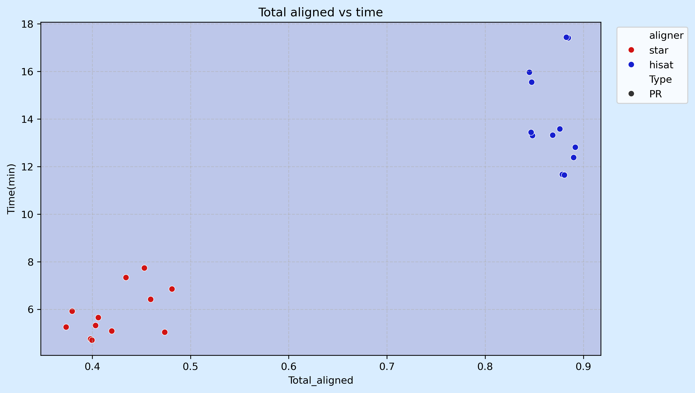
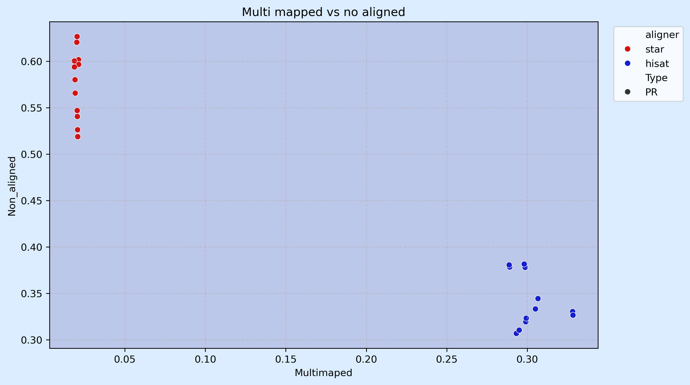
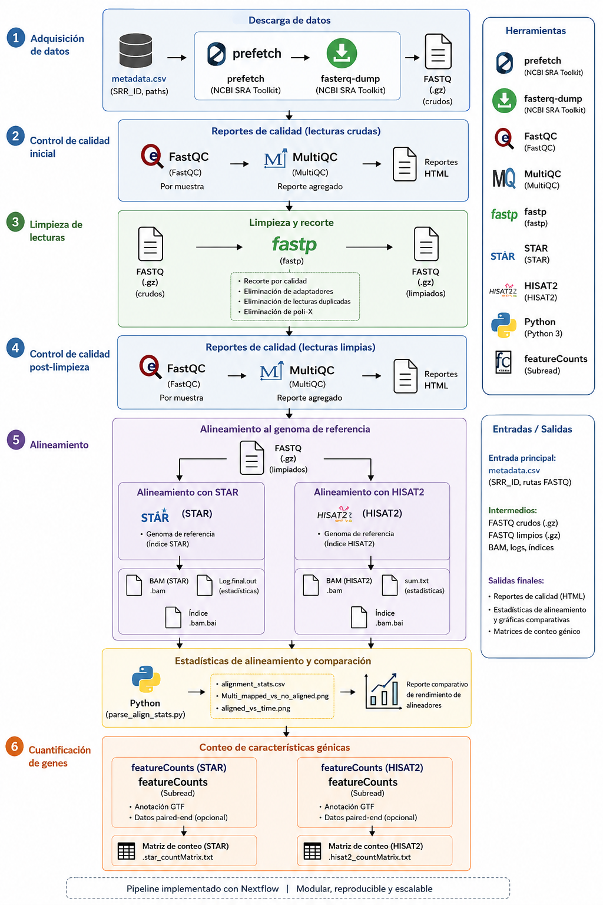
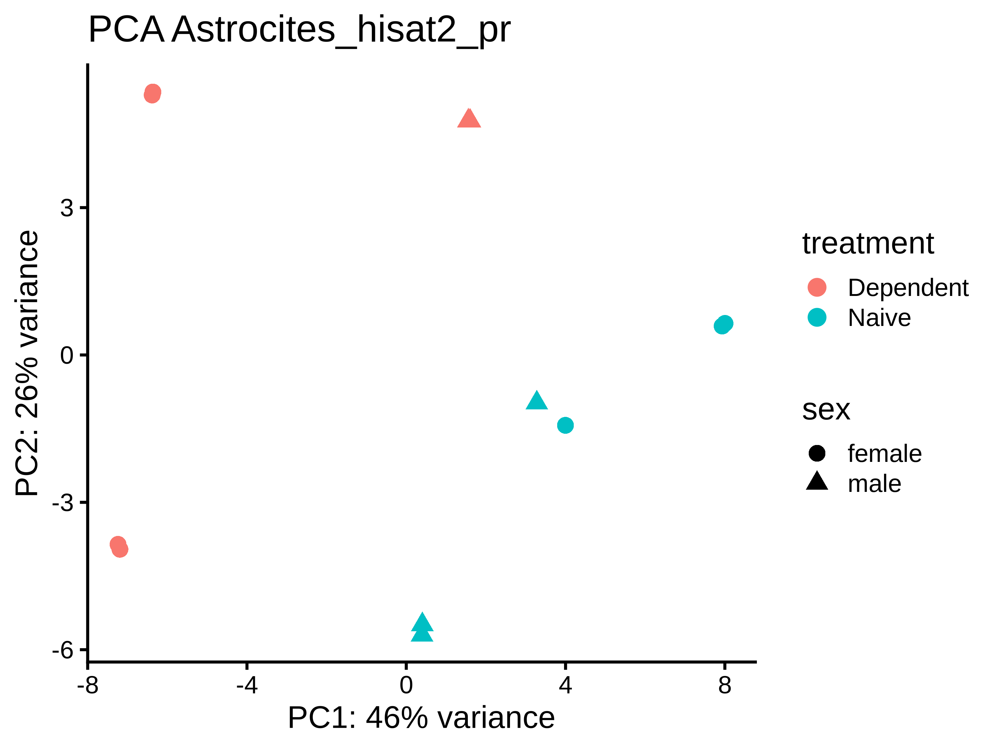
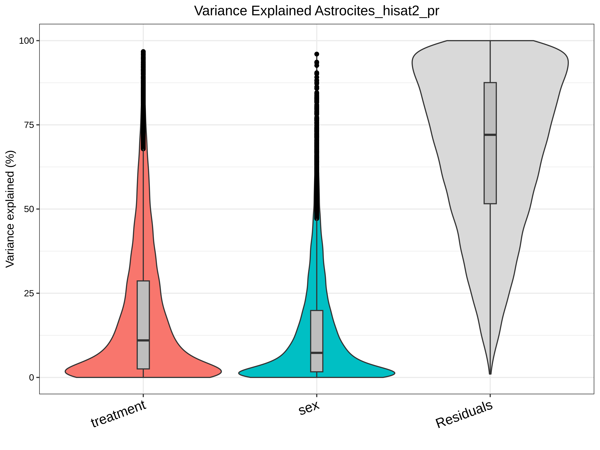
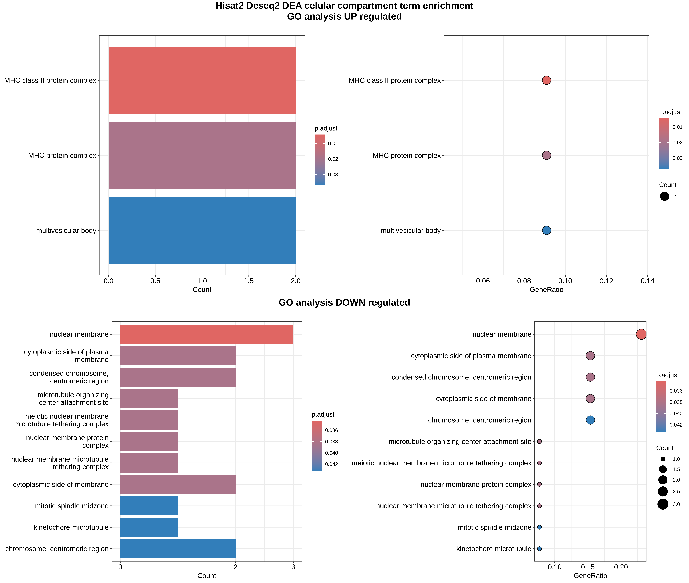

# Diferencias transcriptomicas en los Astrocitos por la influencia de etanol 
        
---
> De Los Santos Huesca Ismael Maximiliano 
>
> LCG - UNAM- semestre 4
>

## Resumen 

El cerebro es probablemente el órgano más complejo con el que contamos los seres humanos, esto implica un mayor número de tipos celulares neuronales que se especializan en distintas funciones fisiológicas en diferentes estructuras cerebrales como el hipotálamo 1. Así mismo, dentro del linaje neuronal las neuronas efectoras de señales como tal no son los únicos tipos importantes para el correcto funcionamiento de este tejido, pues células como las pertenecientes a la glía son fundamentales en muchos procesos tanto homeostáticos como de soporte, plasticidad y protección 2.

Particularmente, los astrocitos son células gliales que participan en el mantenimiento homeostático, modulación y creación de sinapsis, regulación y soporte de las células neuronales; sin embargo, recientemente se ha señalado su papel en procesos como la inflamación, teniendo fenotipos específicos de respuesta a estas perturbaciones y en función de su interacción con la microglía 3. Esto provoca la disrupción de funciones basales de estas células, limitando su capacidad de sostenimiento para las neuronas e incluso causando citotoxicidad.

De esta forma, resulta relevante explorar los mecanismos que influencian los procesos neuroinflamatorios y afectan la homeostasis de estas células, cuyos fenotipos activados y neurotóxicos se encuentran asociados a enfermedades neurodegenerativas como el Alzheimer 4. Un estudio reciente explora la influencia de la dependencia al alcohol (etanol, EtOH) en ratones Aldh1l1-eGFP/Rpl10a 5.

En este repositorio se llevó acabo una análisis de expresión diferencial (DEA) desde la obtención de los datos y su preprosesamiento hasta las pruebas estadisticas y el enriquecimiento funcional para saber la influencia del etanol sobre la expresión de genes en los astrocitos al ser células muy importantes para el soporte del tejido nervioso tanto en humano como en ratones.

Se encontró que

## Contenidos 
- [Datos](#obtención-de-los-datos)
- [Preprocesamiento](#preprocesamiento)
- [DEA](#dea)
- [Enriquecimiento](#enriquecimiento-funcional)
- [Referencias](#referencias)
- [Dsicusión](#discusión-y-conclusiones)
- [Análisis adicionales](#análisis-adicionales)

## Obtención de los datos 

Con el fin de estudiar las diferencias transcripcionales entre las condiciones Dependent (ratones consumidores de alcohol) y Naive (sin consumo de alcohol), se seleccionaron 6 réplicas biológicas de cada condición bajo el identificador de acceso GEO GSE308880 que hubieran sido procesadas en el mismo lote y con una distribución de sexos lo más uniforme posible para considerarse posteriormente en el análisis.

| Run | Bases | batch | Experiment | Fraction | sex | treatment | sample_id |
|-----|-------|-------|------------|----------|-----|-----------|-----------|
| SRR35568686 | 7056141000 | L | SRX30641926 | IP | female | Dependent | Dependent_1 |
| SRR35568638 | 6422935500 | L | SRX30641950 | IP | female | Dependent | Dependent_2 |
| SRR35568687 | 7195563300 | L | SRX30641926 | IP | female | Dependent | Dependent_3 |
| SRR35568639 | 6567543300 | L | SRX30641950 | IP | female | Dependent | Dependent_4 |
| SRR35568650 | 8408655900 | L | SRX30641944 | IP | male | Dependent | Dependent_5 |
| SRR35568651 | 8532258900 | L | SRX30641944 | IP | male | Dependent | Dependent_6 |
| SRR35568623 | 6641559600 | L | SRX30641958 | IP | female | Naive | Naive_1 |
| SRR35568626 | 7019469600 | L | SRX30641956 | IP | male | Naive | Naive_2 |
| SRR35568627 | 7132121400 | L | SRX30641956 | IP | male | Naive | Naive_3 |
| SRR35568631 | 7998479400 | L | SRX30641954 | IP | male | Naive | Naive_4 |
| SRR35568622 | 6489525000 | L | SRX30641958 | IP | female | Naive | Naive_5 |
| SRR35568634 | 7475442300 | L | SRX30641952 | IP | female | Naive | Naive_6 |

## Preprocesamiento 

Para el proceso de descarga y control de calidad (QC) se desarrolló un pipeline en Nextflow que permite realizar ambas tareas simultáneamente [Preprocesmiento nextflow](./src/preprocces_data.nf) 2.

Una vez descargados los datos, el QC reveló que las secuencias presentan un Phred score muy alto , lo que indica una alta confianza en la identificación de bases y, en general, una buena distribución en las métricas relacionadas con la calidad de la secuenciación. Esto sugiere una reacción de secuenciación adecuada, observándose únicamente advertencias (warnings) en las secuencias 1 de cada par respecto a la calidad por posición en el flowcell. Dado que esta advertencia fue uniforme entre las muestras, no representa una fuente importante de sesgo.

Sin embargo, no todas las métricas fueron óptimas, por lo que se procedió a la limpieza de las secuencias mediante el software fastp, el cual permite corregir aquellas regiones que no superan completamente el QC. En nuestros datos fue evidente la presencia de adaptadores, particularmente aquellos enriquecidos en secuencias repetitivas como PolyG y PolyA.

 

Así como un sesgo hacia bases T al inicio de las lecturas. Por ello se ejecutó el siguiente paso del pipeline de Nextflow src/preprocces_data.nf, especificando las opciones –trim_front 1 y –trim_poly_x 3.

### Pipeline nextflow

El pipeline de nextflow [Preprocesmiento nextflow](./src/preprocces_data.nf) lleva a cabo la tareas como la limpieza realizada pero asi mismo el alineamiento de las secuencias mediante dos alineadores tradicionales ampliamente empleados en la literatura. Por un lado, HISAT2 es reconocido por su bajo consumo de recursos computacionales y menor tiempo de ejecución en comparación con otros alineadores tradicionales, siendo una opción accesible para estudios de gran escala y mostrando un buen desempeño en lecturas cortas [18]. Por otro lado, se utilizó STAR, una herramienta destacada por su alta sensibilidad, rendimiento y capacidad de mapeo único [19].

El pipeline utilizado para el alineamiento 5 implementa también la generación de matrices de conteo a partir de los alineamientos obtenidos mediante featureCounts, herramienta perteneciente al paquete subread. Para ello se empleó el archivo de anotación descargado previamente 1 junto con los parámetros mínimos necesarios para su funcionamiento. Se configuró la herramienta para excluir lecturas multimapeadas y considerar todas las lecturas independientemente de su longitud, ya que el análisis de QC mostró una distribución uniforme en este aspecto. Como resultado, fue posible obtener las matrices de conteo correspondientes a HISAT2 [Hisat_matrixes](./results/count_matrixes/hisat_countMatrix.txt).

## DEA 

Para el DEA se opto por la creación de un objeto modular R6 que implementa tanto la previsualización de los datos así como las pruebas estadísticas pertinentes mediante edgeR o DESeq2 [DEA_src](./src/DeLoSantosHuesca_IsmaelMaximiliano_ProyectoFinal_src)

Ambas librerías comparten el hecho de modelar los conteos mediante una distribución binomial negativa para determinar si los genes están diferencialmente expresados. Sin embargo, las diferencias entre ellas radican principalmente en la forma en que estiman la dispersión y las varianzas antes del modelado. Por ejemplo, `DESeq2` utiliza estrategias de contracción (*shrinkage*) y estimaciones basadas en la relación media-varianza, mientras que `edgeR` emplea estimaciones de cuasi-verosimilitud (*quasi-likelihood*).

Para ello se utilizan la matriz de conteos (`Count_matrix`), el modelo definido mediante `model.matrix` (`model`), el contraste de interés (`contrast`, generado mediante `makeContrasts`) y la matriz de metadatos (`meta_data`).

### Definición del modelo 

Por su parte, los métodos son los encargados de realizar tanto la previsualización como el DEA, utilizando como base los atributos definidos desde el método constructor.

###### pre_vi

Naturalmente, este es el primer método que se utiliza y tiene como objetivo identificar cuáles son las variables que explican la mayor parte de la varianza dentro de nuestros datos. Para ello se emplean dos aproximaciones:

- **PCA**

El análisis de componentes principales es un método que realiza una transformación lineal de los datos mediante la identificación de los vectores propios de la matriz de expresión. Este análisis se basa en la covarianza de los distintos genes de la matriz; de esta forma, los vectores propios representan aquellos componentes que explican la mayor proporción de la varianza presente en los datos.

Esto es relevante porque, al representar las muestras mediante estos componentes principales, es posible observar cómo se separan entre sí. Asimismo, al incorporar las variables experimentales en la visualización, se puede determinar si la variable de interés es capaz de discriminar las muestras a lo largo de alguno de los componentes principales. Del mismo modo, también permite identificar variables que no fueron contempladas explícitamente en el diseño experimental pero que podrían estar influyendo sobre la varianza de los datos e introduciendo posibles efectos de lote.

Para este análisis se eligieron las variables "treatment" y "sex" de nuestra matriz de metadatos con el objetivo de evaluar la influencia de ambas sobre la dispersión de los datos. Estas variables fueron seleccionadas debido a que la variable principal de interés experimental es el tratamiento (treatment), mientras que sex es la única de las variables remanentes que presenta más de un valor a lo largo de las muestras y, por lo tanto, podría contribuir a explicar parte de la variabilidad observada. El proceso de previsualización permite filtrar los datos en función de su nivel de expresión mediante la función filter_by_expression diseñada anteriormente, conservando un total de 18,305 genes.

El PCA muestra una clara separación de las muestras en función de nuestra variable de interés (`treatment`). Sin embargo, ninguno de los dos primeros componentes principales (PCs), a pesar de capturar una fracción importante de la varianza total, logra separar completamente las condiciones experimentales. Esto sugiere que las diferencias observadas entre nuestras muestras probablemente estén influenciadas por múltiples factores biológicos y técnicos.

Por otra parte, la influencia de la variable `sex` tampoco resulta concluyente en la representación de los primeros componentes principales. En este contexto, el análisis de partición de varianza puede ser más informativo para determinar qué variables deben considerarse dentro del modelo estadístico.

Asimismo, el PCA adelanta que existe una señal biológica asociada al tratamiento, pero esta parece ser relativamente discreta y distribuida entre múltiples fuentes de variación. Esto se refleja en la proporción de varianza que no es capturada por los primeros componentes principales y que podría estar contribuyendo a que las muestras no se separen completamente en el espacio reducido del PCA.

- **Partición de varianza**

Se utiliza para observar qué proporción de la varianza total es explicada por cada variable presente en la matriz de metadatos. Al igual que el PCA, este análisis ayuda a definir qué variables deben considerarse dentro del modelo.

En el caso específico de la función `fitExtractVarPartModel`, esta ajusta un modelo lineal que posteriormente podría emplearse para análisis de expresión diferencial mediante herramientas como `dream` o `limma-voom` \[17\]. Sin embargo, en este trabajo se utilizó únicamente para cuantificar la varianza explicada por cada variable.

Ambos análisis hacen uso de un objeto `vst` generado mediante la paquetería `DESeq2`, con el objetivo de obtener una matriz normalizada adecuada para el análisis de componentes principales y la partición de varianza. Para ello se requiere una variable principal (`var_main`), normalmente la variable de interés biológico, así como una o más covariables para la partición de varianza. La primera covariable también se utiliza como referencia secundaria en la representación gráfica del PCA. Además, estos procedimientos hacen uso de los atributos `Count_matrix`, `meta_data` y, opcionalmente, `model`.

Por su parte, el análisis de partición de varianza mostró una influencia clara de ambas variables consideradas sobre la variabilidad de nuestros datos. Ambas presentaron distribuciones similares en cuanto a la proporción de varianza explicada, lo que resulta consistente con la naturaleza relativamente discreta de los efectos biológicos que buscamos detectar. Estos resultados respaldan la importancia de considerar ambas variables dentro del modelo lineal utilizado para el análisis de expresión diferencial.

> La matriz generada por el alineador STAR mostró distribuciones similares durante la previsualización. Sin embargo, estas presentaron un mayor nivel de ruido y una separación menos definida entre las muestras en el PCA [STAR DEA](#DEA_star).

### Testeo 

Una vez realizada la previsualización de los datos, se procedió a ejecutar formalmente el análisis de expresión diferencial. Como se observó en los análisis exploratorios anteriores, la variación asociada a nuestras condiciones experimentales parece corresponder a un efecto relativamente discreto más que a una diferencia marcada entre grupos. Asimismo, tanto `treatment` como `sex` mostraron una contribución apreciable a la variabilidad de los datos, por lo que se optó por modelar las diferencias entre condiciones mediante un modelo lineal generalizado aditivo que considera ambas variables:

$$
y = β_0 + β_{treatment} + β_{sex} + ε
$$

Para ello se construyó la matriz de diseño mediante la función `model.matrix`, utilizando los factores previamente convertidos a partir de la tabla de metadatos. Asimismo, el contraste seleccionado para las pruebas de hipótesis realizadas con la herramienta `DESeq2` fue el correspondiente a nuestra variable de interés, `treatment`, comparando los individuos dependientes de etOH (`Dependent`) frente a aquellos sin consumo de alcohol (`Naive`).

Este contraste fue evaluado teniendo en cuenta la variabilidad asociada a la variable `sex`, la cual fue incluida dentro del modelo. Finalmente, la matriz de contraste se generó mediante la función `makeContrast`.

| Sample                      | ALL | DOWN | UP  |
|-----------------------------|-----|------|-----|
| Astrocites_hisat2_pr_DESeq2 | 123 | 50   | 73  |

En esta configuración, definida a través de las herramientas de previsualización, se lograron identificar un total de **123 genes diferencialmente expresados**, de los cuales **73 se encuentran sobreexpresados** en los individuos que desarrollaron dependencia al alcohol, mientras que **50 se encuentran subexpresados**.

Es importante señalar que los genes clasificados como subexpresados no deben interpretarse simplemente como genes sobreexpresados en los individuos sin consumo de alcohol, sino como genes cuya expresión relativa es menor en la condición `Dependent` respecto a la condición `Naive`, de acuerdo con el contraste definido en el modelo.

Code [DEA](./src/DeLoSantosHuesca_IsmaelMaximiliano_ProyectoFinal_src).

### Representación resultados 

#### Volcano plot

 

La visualización mediante el volcano plot nos permite profundizar en el punto anterior, ya que se observa que los cambios más pronunciados en la expresión corresponden principalmente a genes subexpresados en los individuos con dependencia al alcohol. Esto es relevante porque sugiere que programas biológicos que normalmente se encuentran activos de manera basal en los astrocitos podrían verse atenuados como consecuencia del consumo prolongado de alcohol, lo que potencialmente contribuiría a la disrupción de funciones esenciales de estas células.

Por otro lado, también se identificaron genes sobreexpresados en la condición `Dependent`, lo que indica la activación de programas transcripcionales específicos en respuesta a la exposición crónica al alcohol. En conjunto, estos resultados sugieren que la dependencia al alcohol no solo reduce la actividad de procesos celulares basales, sino que también induce mecanismos de respuesta adaptativa dentro de los astrocitos.

Por último, el heatmap permite visualizar los perfiles de expresión característicos de ambas condiciones experimentales. Se puede observar cómo los z-scores calculados a partir de las matrices de conteos normalizadas presentan cierta heterogeneidad entre las muestras, lo que respalda la idea de que las diferencias detectadas corresponden a efectos biológicos relativamente discretos más que a cambios drásticos en la expresión génica.

Asimismo, esta representación permite apreciar cómo el número de réplicas biológicas contribuye a la identificación de genes diferencialmente expresados, ya que la consistencia de los patrones de expresión entre muestras es uno de los factores clave para alcanzar significancia estadística en el análisis.

> Los conjuntos de genes identificados mediante `edgeR` [edgeR hisat2](#DEA_hisat2_edgeR), así como aquellos obtenidos a partir de la matriz generada por STAR [STAR DEA](#DEA_star), mostraron un número considerablemente menor de genes diferencialmente expresados. Aunque los resultados obtenidos fueron consistentes entre las réplicas, la capacidad de detección fue inferior a la observada con la combinación `hisat2` + `DESeq2`. Por esta razón, se seleccionaron los resultados generados con estas dos herramientas para los análisis posteriores.

## Enriquecimiento funcional

### GO

Se utilizó el análisis de enriquecimiento de términos mediante Ontología de Genes (GO) para caracterizar las funciones biológicas asociadas a los genes diferencialmente expresados. En particular, se evaluaron las categorías de **proceso biológico** (`BP`), **compartimiento celular** (`CC`) y **función molecular** (`MF`) mediante la función `enrichGO` de la librería `clusterProfiler`\[20\], utilizando la información de anotación contenida en la base de datos `org.Mm.eg.db` y los identificadores `ENSMBL` presentes en la matriz de genes diferencialmente expresados.

Asimismo, para incrementar la cantidad de genes disponibles para el análisis de enriquecimiento y mejorar la capacidad de detección de categorías funcionales, se empleó un criterio de selección menos estricto que el utilizado en el DEA, conservando únicamente aquellos genes con un valor absoluto de **log2 fold change** mayor o igual a 1 (`|LFC| ≥ 1`) y un \*\*FDR ≤ 0.05\`. Posteriormente, los genes sobreexpresados y subexpresados se analizaron por separado con el fin de identificar procesos biológicos asociados específicamente a cada dirección del cambio transcripcional.

Se obtuvo una amplia variedad de términos enriquecidos dentro de los genes sobreexpresados en los astrocitos de individuos dependientes del alcohol. Entre los procesos más relevantes destacan aquellos relacionados con vías de señalización celular como **ERK1/ERK2** y **NF-κB**. Esta última resulta particularmente importante debido a su papel central en la regulación de la inflamación y de la respuesta inmune.

Asimismo, se observó un enriquecimiento significativo en términos asociados con el **complejo mayor de histocompatibilidad de clase II (MHC II)** y la **presentación de antígenos**, siendo la activación de la respuesta celular uno de los procesos más representados. Estos resultados sugieren una respuesta asociada al daño tisular y a la activación inmunitaria en los astrocitos expuestos crónicamente al alcohol.

De manera consistente, también se identificó enriquecimiento en procesos relacionados con la proliferación y respuesta de fibroblastos, fenómenos frecuentemente asociados con el daño tisular y la remodelación de la matriz extracelular.

Por su parte, el análisis de enriquecimiento por compartimiento celular mostró resultados concordantes con los observados en los procesos biológicos, destacando nuevamente la sobreexpresión de genes asociados al **MHC II**. Además, esta fue la única categoría en la que se identificaron términos enriquecidos para los genes subexpresados, predominando aquellos relacionados con la **división celular**.

Finalmente, los términos enriquecidos en la categoría de función molecular también estuvieron estrechamente relacionados con componentes y funciones asociadas al **MHC II**, reforzando la evidencia de una activación de mecanismos inmunitarios e inflamatorios en los astrocitos de los individuos con dependencia al alcohol.

Code [GO](./src/DeLoSantosHuesca_IsmaelMaximiliano_ProyectoFinal_src)

### GSEA

Por su parte, para realizar un análisis de enriquecimiento funcional más sensible y capaz de aprovechar toda la información disponible en los datos, se utilizó el método **Gene Set Enrichment Analysis (GSEA)** mediante la función `gseGO` y la base de datos `org.Mm.eg.db`. El análisis se enfocó exclusivamente en los términos de **proceso biológico** (`BP`), ya que esta categoría fue la que presentó el mayor enriquecimiento durante el análisis de sobre representación realizado previamente con `enrichGO`.

A diferencia del análisis tradicional de enriquecimiento de términos, GSEA no requiere definir de manera arbitraria una lista de genes diferencialmente expresados. En su lugar, utiliza una lista ordenada de todos los genes evaluados durante el DEA, permitiendo detectar cambios coordinados en conjuntos de genes aun cuando muchos de ellos no superen individualmente los umbrales de significancia.

Debido a ello, para este análisis no se aplicó un filtrado basado en **log fold change** o **FDR**. En cambio, los genes fueron ordenados utilizando el estadístico `stat` reportado por `DESeq2`. Este estadístico resulta especialmente útil porque integra tanto la magnitud del cambio de expresión como la incertidumbre asociada a dicha estimación. De esta manera, genes con cambios elevados pero con una gran variabilidad entre muestras reciben una menor ponderación, mientras que aquellos con cambios consistentes obtienen una mayor relevancia dentro del ranking.

El uso del estadístico `stat` permite conservar una mayor cantidad de genes para el análisis, aumentando la cobertura de los conjuntos funcionales evaluados y proporcionando una mayor potencia estadística para detectar procesos biológicos enriquecidos sin depender de umbrales de corte estrictos.

El análisis GSEA mostró resultados consistentes con los obtenidos previamente mediante el análisis de enriquecimiento de términos. El conjunto de genes más enriquecido correspondió al procesamiento y presentación de antígenos, encontrándose sobre regulado en los astrocitos de los individuos con dependencia al etanol. Esta tendencia se mantiene en los otros siete conjuntos de genes enriquecidos, donde predominan procesos relacionados con la respuesta inflamatoria mediada por interferón, el procesamiento y presentación de antígenos asociados a la respuesta inmune, así como mecanismos de detoxificación celular.

En conjunto, estos resultados refuerzan la evidencia de una activación de programas transcripcionales relacionados con la respuesta inmunitaria y el estrés celular en los astrocitos de los individuos dependientes de etanol. Además, la concordancia entre los resultados obtenidos mediante `enrichGO` y GSEA aporta una mayor confianza biológica a las vías identificadas, sugiriendo que la exposición crónica al alcohol induce una respuesta neuroinflamatoria caracterizada por la activación de mecanismos de procesamiento antigénico, señalización por interferón y respuesta a daño celular.

### String

A diferencia de los análisis de enriquecimiento de términos, el enriquecimiento funcional que realiza `STRING` \[21\] se basa en las interacciones proteína-proteína que pueden presentar nuestros genes diferencialmente expresados. Se aplicó este análisis para evaluar la conexión entre los genes identificados utilizando las mismas cotas asignadas para el DEA (FDR ≤ 0.0001 y \|LFC\| ≥ 1). Debido a que los efectos observados son discretos, se seleccionó un score mínimo de interacción bajo de 150.

Se puede observar que, de acuerdo con el score bajo de interacción utilizado, la mayoría de las interacciones externas se basan en coexpresión génica (líneas negras) y minería de literatura (líneas amarillas), seguidas por las interacciones predichas por `STRING` (líneas verdes, rojas y azules) presentes en nodos más internos. Las únicas interacciones respaldadas por evidencia experimental o previamente reportadas (líneas azules y magenta) corresponden principalmente a las conexiones centrales de la red. Sin embargo, la elevada conectividad general de la red, sustentada principalmente por patrones de coexpresión, sugiere la existencia de un programa transcripcional coordinado asociado con los términos enriquecidos identificados mediante GSEA y GO.

Un aspecto relevante de este análisis es la conexión entre procesos biológicos que no resulta tan evidente en los dos análisis anteriores. En particular, los términos enriquecidos relacionados con la respuesta inmune y la proliferación de fibroblastos se encuentran conectados mediante las interacciones identificadas por `STRING`. Esto se observa especialmente alrededor del nodo central **Cd74**, el cual participa en el procesamiento y estabilización de antígenos asociados al complejo MHC II. Como era de esperarse, este gen interactúa con otras proteínas relacionadas con la respuesta inmune, como **Ifitm3** e **Ifit3**, asociadas a la señalización por interferón, así como con genes vinculados a la proliferación fibroblástica, entre ellos **S100a11**, **Itga4** y **Krt15**. En conjunto, estos resultados sugieren que la exposición al etanol induce cambios transcripcionales no solo relacionados con la respuesta inflamatoria, sino también con mecanismos asociados al daño celular y la toxicidad tisular.

## Discusión y conclusiones

El análisis de expresión diferencial es un procedimiento compuesto por múltiples pasos antes de llegar a lo que aparenta ser la etapa más directa: las pruebas de hipótesis. En este proyecto se comprobó que este proceso no es del todo *straight-forward*, ya que existe una alta dependencia tanto de los datos como de las herramientas utilizadas, pudiendo diferir de lo reportado en la literatura \[18\]. Particularmente, para los datos analizados en este estudio, el alineador `hisat2` mostró un mejor desempeño, aunque con un claro *trade-off* en el tiempo consumido, en contraste con lo reportado previamente \[19\]. Por su parte, la elección de la herramienta para realizar el DEA también resultó relevante, ya que `DESeq2` mostró una mayor capacidad de detección frente a `edgeR`, a pesar de que ambas herramientas modelan las diferencias entre condiciones utilizando la distribución binomial negativa.

Por otro lado, la etapa de previsualización resultó crítica, pues desde este punto las diferencias biológicas entre nuestras dos condiciones de estudio (astrocitos obtenidos de ratones dependientes de etanol frente a ratones no consumidores) parecían ser discretas, aunque con una clara separación entre condiciones. Esto se relaciona con la varianza moderada observada mediante el análisis de partición de varianza, el cual ayudó a definir un modelo lineal aditivo considerando la contribución de ambas variables presentes en los datos. Gracias a ello fue posible identificar un mayor número de diferencias biológicas bajo criterios estadísticos estrictos.

Este proyecto demostró la existencia de cambios en el panorama transcripcional de los astrocitos del núcleo accumbens tras la exposición crónica al etanol. La variación observada entre las condiciones experimentales parece estar impulsada principalmente por efectos discretos en la expresión génica. Resulta particularmente relevante que un número relativamente pequeño de genes diferencialmente expresados permitiera identificar posibles programas fisiológicos asociados a la respuesta crónica al etanol mediante análisis de enriquecimiento de términos (GO) y enriquecimiento de conjuntos génicos (GSEA). Estos análisis permitieron identificar una clara respuesta inflamatoria en los astrocitos @fig-go-bp, un hallazgo relevante debido a que numerosos procesos neurodegenerativos se encuentran asociados con estados de neuroinflamación, los cuales han sido propuestos como posibles impulsores de la neurotoxicidad mediada por astrocitos \[1,3\]. Asimismo, estos resultados permiten plantear la hipótesis de una posible disminución de la plasticidad cerebral asociada al consumo de alcohol, reflejada por la subregulación de genes relacionados con la división celular en células astrogliales.

Finalmente, el análisis realizado mediante `STRING` permitió integrar los resultados obtenidos por GO y GSEA dentro de una red de interacciones proteína-proteína sustentadas tanto por evidencia experimental como por asociaciones inferidas. Estas interacciones sugieren la existencia de un programa transcripcional coordinado relacionado con procesos inflamatorios y su influencia sobre distintos componentes celulares, como la matriz extracelular y el citoesqueleto. En conjunto, estos resultados apuntan hacia mecanismos asociados con la respuesta al daño celular y la toxicidad inducida por la exposición crónica al etanol.

## Referencias 
1.  Liddelow, S., Guttenplan, K., Clarke, L. et al. Neurotoxic reactive astrocytes are induced by activated microglia. Nature 541, 481–487 (2017). https://doi.org/10.1038/nature21029

2.  Garland, E. F., Hartnell, I. J., & Boche, D. (2022). Microglia and Astrocyte Function and Communication: What Do We Know in Humans? Frontiers In Neuroscience, 16, 824888. https://doi.org/10.3389/fnins.2022.824888

3.  .Liddelow SA, Guttenplan KA, Clarke LE, Bennett FC, Bohlen CJ, Schirmer L, Bennett ML, Münch AE, Chung WS, Peterson TC, Wilton DK, Frouin A, Napier BA, Panicker N, Kumar M, Buckwalter MS, Rowitch DH, Dawson VL, Dawson TM, Stevens B, Barres BA. Neurotoxic reactive astrocytes are induced by activated microglia. Nature. 2017 Jan 26;541(7638):481-487. doi: 10.1038/nature21029. Epub 2017 Jan 18. PMID:28099414; PMCID: PMC5404890.

4.  Romanov, R. A., Zeisel, A., Bakker, J., Girach, F., Hellysaz, A., Tomer, R., Alpár, A., Mulder, J., Clotman, F., Keimpema, E., Hsueh, B., Crow, A. K., Martens, H., Schwindling, C., Calvigioni, D., Bains, J. S., Máté, Z., Szabó, G., Yanagawa, Y., . . . Harkany, T. (2016). Molecular interrogation of hypothalamic organization reveals distinct dopamine neuronal subtypes. Nature Neuroscience, 20(2), 176-188. https://doi.org/10.1038/nn.4462

5.  Hashimoto, J. G., Mangieri, R. A., Roberts, A. J., Lime, T., Davis, B. A., Carbone, L., Roberto, M., & Guizzetti, M. (2025). Alcohol dependence-induced astrocyte immune activation in the nucleus accumbens. Neurobiology Of Disease, 217, 107171. https://doi.org/10.1016/j.nbd.2025.107171

6.  Leinonen, R., Sugawara, H., Shumway, M., & International Nucleotide Sequence Database Collaboration. (2011). The sequence read archive. Nucleic Acids Research, 39(suppl_1), D19–D21. https://doi.org/10.1093/nar/gkq1019

7.  Chen, S., Zhou, Y., Chen, Y., & Gu, J. (2018). fastp: An ultra-fast all-in-one FASTQ preprocessor. Bioinformatics, 34(17), i884–i890. https://doi.org/10.1093/bioinformatics/bty560

8.  Andrews, S. (2010). FastQC: A quality control tool for high throughput sequence data \[Software\]. Babraham Bioinformatics. https://www.bioinformatics.babraham.ac.uk/projects/fastqc/

9.  Ewels, P., Magnusson, M., Lundin, S., & Käller, M. (2016). MultiQC: Summarize analysis results for multiple tools and samples in a single report. Bioinformatics, 32(19), 3047–3048. https://doi.org/10.1093/bioinformatics/btw354

10. Dobin, A., Davis, C. A., Schlesinger, F., Drenkow, J., Zaleski, C., Jha, S., Batut, P., Chaisson, M., & Gingeras, T. R. (2013). STAR: Ultrafast universal RNA-seq aligner. Bioinformatics, 29(1), 15–21. https://doi.org/10.1093/bioinformatics/bts635

11. Kim, D., Langmead, B., & Salzberg, S. L. (2015). HISAT: A fast spliced aligner with low memory requirements. Nature Methods, 12(4), 357–360. https://doi.org/10.1038/nmeth.3317

12. Liao, Y., Smyth, G. K., & Shi, W. (2014). featureCounts: An efficient general purpose program for assigning sequence reads to genomic features. Bioinformatics, 30(7), 923–930. https://doi.org/10.1093/bioinformatics/btt656

13. Love, M. I., Huber, W., & Anders, S. (2014). Moderated estimation of fold change and dispersion for RNA-seq data with DESeq2. Genome Biology, 15(12), 550. https://doi.org/10.1186/s13059-014-0550-8

14. Hoffman, G. E., & Schadt, E. E. (2016). variancePartition: Interpreting drivers of variation in complex gene expression studies. BMC Bioinformatics, 17, 483. https://doi.org/10.1186/s12859-016-1323-z

15. Robinson, M. D., McCarthy, D. J., & Smyth, G. K. (2010). edgeR: A Bioconductor package for differential expression analysis of digital gene expression data. Bioinformatics, 26(1), 139–140. https://doi.org/10.1093/bioinformatics/btp616

16. Ritchie, M. E., Phipson, B., Wu, D., Hu, Y., Law, C. W., Shi, W., & Smyth, G. K. (2015). limma powers differential expression analyses for RNA-sequencing and microarray studies. Nucleic Acids Research, 43(7), e47. https://doi.org/10.1093/nar/gkv007

17. Genome Reference Consortium. (2020). Mouse genome assembly GRCm39. National Center for Biotechnology Information. https://www.ncbi.nlm.nih.gov/grc/mouse/data?asm=GRCm39

18. Coxe, T., Burks, D. J., Singh, U., Mittler, R., & Azad, R. K. (2024). Benchmarking RNA-Seq Aligners at Base-Level and Junction Base-Level Resolution Using the Arabidopsis thaliana Genome. Plants, 13(5), 582. https://doi.org/10.3390/plants13050582

19. Baruzzo, G., Hayer, K. E., Kim, E. J., Di Camillo, B., FitzGerald, G. A., & Grant, G. R. (2016). Simulation-based comprehensive benchmarking of RNA-seq aligners. Nature Methods, 14(2), 135-139. https://doi.org/10.1038/nmeth.4106

20. Yu, G., Wang, L., Han, Y., & He, Q. (2012). clusterProfiler: an R Package for Comparing Biological Themes Among Gene Clusters. OMICS A Journal Of Integrative Biology, 16(5), 284-287. https://doi.org/10.1089/omi.2011.0118

21. STRING. (2023, 26 julio). *STRING: functional protein association networks*. https://string-db.org/cgi/input?sessionId=bEVlDPhubey6&input_page_show_search=off

## Reproducibilidad 

Entorno: R 4.4.3 · Bioconductor 3.20 · x86_64 CentOS Stream 9

| Package           | Version | Source       |
|-------------------|---------|--------------|
| DESeq2            | 1.46.0  | Bioconductor |
| edgeR             | 4.4.2   | Bioconductor |
| ComplexHeatmap    | 2.22.0  | Bioconductor |
| variancePartition | 1.36.3  | Bioconductor |
| clusterProfiler   | 4.14.6  | Bioconductor |
| enrichplot        | 1.26.6  | Bioconductor |
| org.Mm.eg.db      | 3.20.0  | Bioconductor |
| AnnotationDbi     | 1.68.0  | Bioconductor |
| ggplot2           | 4.0.3   | CRAN         |
| dplyr             | 1.2.1   | CRAN         |
| tidyr             | 1.3.2   | CRAN         |
| tibble            | 3.3.1   | CRAN         |
| knitr             | 1.51    | CRAN         |
| kableExtra        | 1.4.0   | CRAN         |
| gridExtra         | 2.3     | CRAN         |
| R6                | 2.6.1   | CRAN         |

Entorno: Python 3.13.13 · conda-forge · GCC 14.3.0 · Linux x86_64 · CentOS Stream 9 · 2026-05-31

| Package        | Version |
|----------------|---------|
| pandas         | 2.3.3   |
| numpy          | 2.4.3   |
| session_info   | 1.0.0   |
| tabulate       | 0.10.0  |
| IPython        | 9.13.0  |
| jupyter_client | 8.8.0   |
| jupyter_core   | 5.9.1   |
| jupyterlab     | 4.5.7   |

## Análisis adicionales 
Los análisis adicionales así como el resumen y la documentación del código más en profundidad puede ser consultada en el [reporte](./src/DeLoSantosHuesca_IsmaelMaximiliano_ProyectoFinal)
