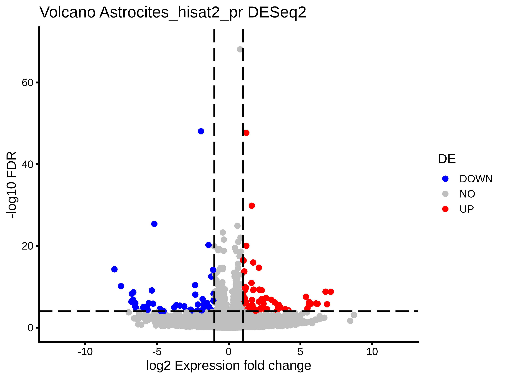
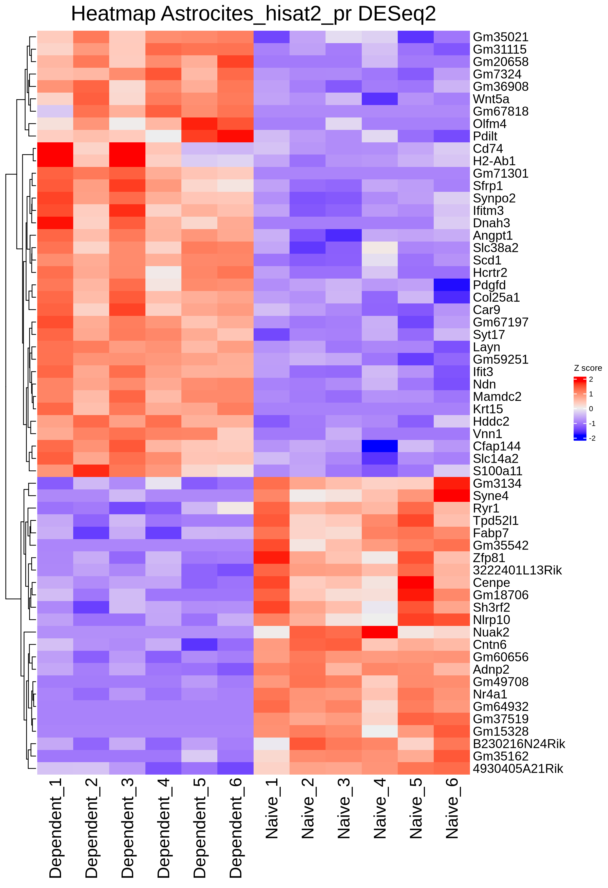
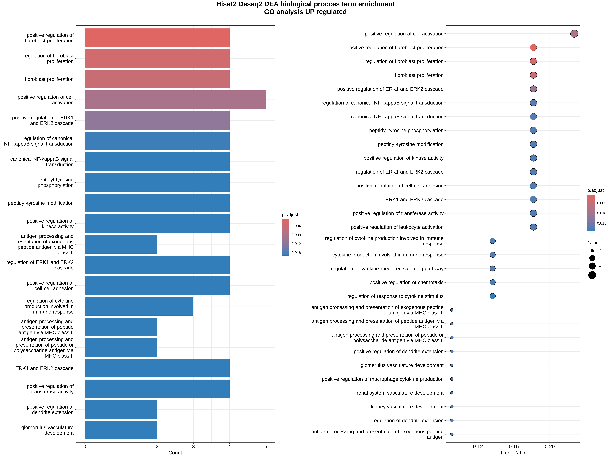
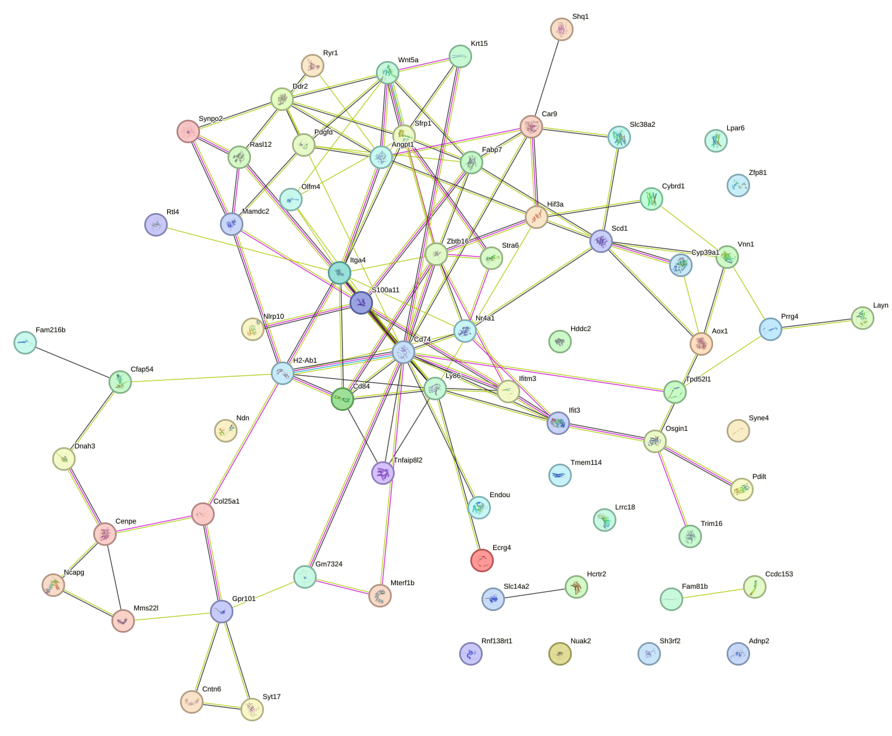
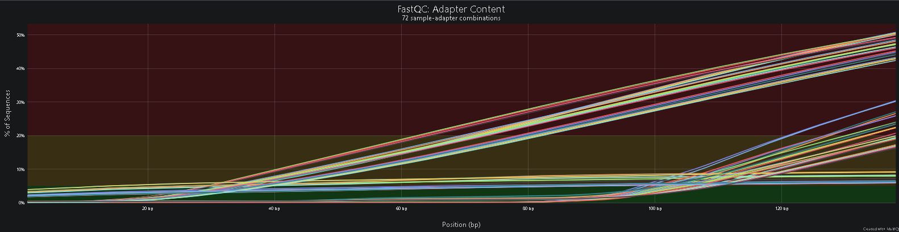
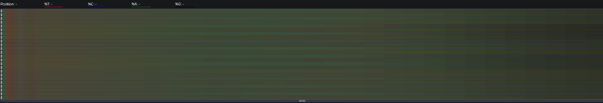
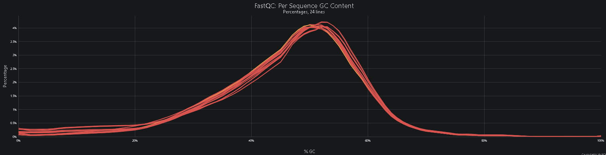
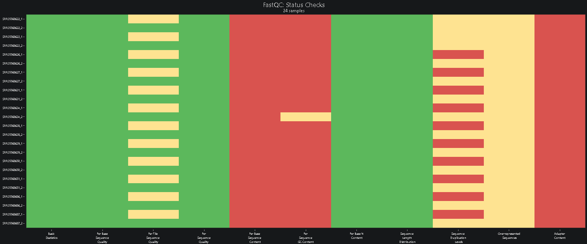
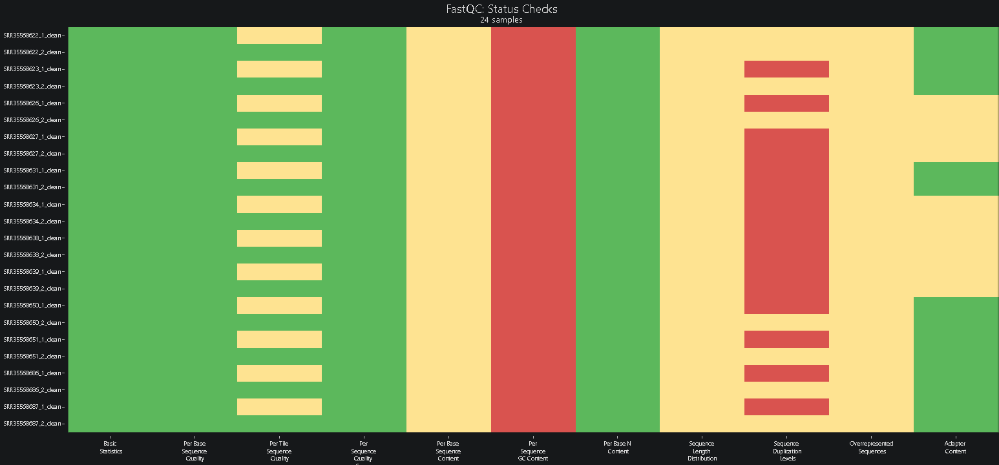
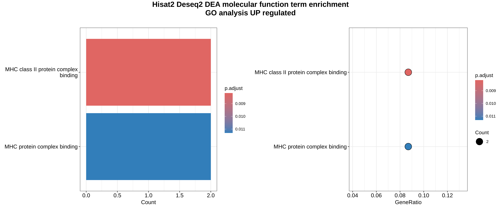

\newpage

```{r}
R.home()
version$version.string
```

```{r r_setup}
#| echo: false 
#| warning: false
#| message: false
#R envirorment
# Primer chunk de tu .qmd
.libPaths(
  "/export/space3/users/ismadlsh/conda/envs/rnaseq_r/lib/R/library",
)

# Carga el core de Bioconductor en orden explícito
suppressPackageStartupMessages({
  library(BiocGenerics)
  library(S4Vectors)
  library(IRanges)
  library(GenomeInfoDb)
  library(SparseArray)
  library(MatrixGenerics)
  library(SummarizedExperiment)
  library(Biobase)
})

# Luego el resto
library(DESeq2)
library(ggplot2)
library(ComplexHeatmap)
library(dplyr)
library(tibble)
library(edgeR)
library(knitr)
library(tidyr)
library(kableExtra)
library(variancePartition)
library(R6)
library(gridExtra)
library(grid)
library(org.Mm.eg.db)
library(clusterProfiler)
library(AnnotationDbi)
library(enrichplot)
library(reformulas)
```

```{python}
#| echo: false
#| warning: false
#| message: false

import pandas as pd
from IPython.display import display
from tabulate import tabulate
from IPython.display import Latex, display
import textwrap


def render_table(
    df,
    rows=20,
    font_size="scriptsize",
    resize=True,
    index=False,
    caption=None,
    label=None
):

    table = tabulate(
        df.head(rows),
        headers="keys",
        tablefmt="latex",
        showindex=index
    )

    latex_code = "\\begin{table}[htbp]\n\\centering\n"

    if font_size:
        latex_code += f"\\{font_size}\n"

    if resize:
        latex_code += (
            f"\\resizebox{{\\textwidth}}{{!}}{{%\n"
            f"{table}\n"
            f"}}\n"
        )
    else:
        latex_code += table + "\n"

    if caption:
        latex_code += f"\\caption{{{caption}}}\n"

    if label:
        latex_code += f"\\label{{{label}}}\n"

    latex_code += "\\end{table}"

    display(Latex(latex_code))

def pretty_print(text, width=100):
    """
    Imprime texto ajustado al ancho deseado.
    """

    print(
        textwrap.fill(
            str(text), width=width, break_long_words=False, break_on_hyphens=False
        )
    )
```

# Introducción

El cerebro es probablemente el órgano más complejo con el que contamos los seres humanos, esto implica un mayor número de tipos celulares neuronales que se especializan en distintas funciones fisiológicas en diferentes estructuras cerebrales como el hipotálamo [1](#section). Así mismo, dentro del linaje neuronal las neuronas efectoras de señales como tal no son los únicos tipos importantes para el correcto funcionamiento de este tejido, pues células como las pertenecientes a la glía son fundamentales en muchos procesos tanto homeostáticos como de soporte, plasticidad y protección [2](#section-1).

Particularmente, los astrocitos son células gliales que participan en el mantenimiento homeostático, modulación y creación de sinapsis, regulación y soporte de las células neuronales; sin embargo, recientemente se ha señalado su papel en procesos como la inflamación, teniendo fenotipos específicos de respuesta a estas perturbaciones y en función de su interacción con la microglía [3](#section-2). Esto provoca la disrupción de funciones basales de estas células, limitando su capacidad de sostenimiento para las neuronas e incluso causando citotoxicidad.

De esta forma, resulta relevante explorar los mecanismos que influencian los procesos neuroinflamatorios y afectan la homeostasis de estas células, cuyos fenotipos activados y neurotóxicos se encuentran asociados a enfermedades neurodegenerativas como el Alzheimer [4](#section-3). Un estudio reciente explora la influencia de la dependencia al alcohol (etanol, EtOH) en ratones *Aldh1l1-eGFP/Rpl10a* [5](#section-4). En el mismo se genera una dependencia a esta sustancia mediante la ingesta constante de los individuos para analizar las muestras extraídas del núcleo accumbens (NAc) y observar las muestras generales dentro del tejido cerebral y particularmente de las células astrocíticas, para las cuales utilizan **TRAP** (*translating ribosome affinity purification*, muestras IP) y de esta forma aislar solamente los ácidos nucleicos de los astrocitos.

## Planteamiento

Con el fin de estudiar las diferencias transcripcionales entre las condiciones *Dependent* (ratones consumidores de alcohol) y *Naive* (sin consumo de alcohol), se seleccionaron 6 réplicas biológicas de cada condición bajo el identificador de acceso GEO `GSE308880` que hubieran sido procesadas en el mismo lote y con una distribución de sexos lo más uniforme posible para considerarse posteriormente en el análisis.

```{python}
#| warning: false
#| message: false
#| echo: false

raw_metadata = pd.read_csv("data/GSE308880_eOH_dependence_metadata.csv")

# clean only keeping the relevant information
clean_metadata = raw_metadata[
    ["Run", "Bases", "batch", "Experiment", "Fraction", "sex", "treatment"]
]

clean_metadata["sample_id"] = ["nan" for row in clean_metadata.index]
naive = 1
depen = 1

for srr_id in list(clean_metadata["Run"]):
    # obtain the treatment associated
    treat_t=clean_metadata.loc[clean_metadata["Run"] == srr_id, "treatment"].iloc[0]
    if treat_t == "Dependent":
      sample_id = "Dependent" + "_" + str(depen)
      clean_metadata.loc[clean_metadata["Run"] == srr_id, "sample_id"] = sample_id
      depen += 1
    else:
      clean_metadata.loc[clean_metadata["Run"] == srr_id, "treatment"] ="Naive"
      sample_id = "Naive" + "_" + str(naive)
      clean_metadata.loc[clean_metadata["Run"] == srr_id, "sample_id"] = sample_id
      naive += 1

clean_metadata.sort_values("sample_id", inplace=True) 

clean_metadata.to_csv("data/GSE308880_eOH_dependence_metadata_clean.csv", index=False)
```

Con el objetivo de evaluar estas diferencias se llevó a cabo un análisis de expresión diferencial (DEA) entre ambas condiciones. Para ello, se realizó la descarga de los datos de secuenciación a través de los identificadores únicos de *Short Read Run* (SRR) mediante `fasterq-dump` [6](#section-5). Asimismo, se utilizaron herramientas de limpieza de archivos de secuenciación como `fastp` \[7\], cuyos parámetros de limpieza fueron definidos a partir de los reportes de control de calidad generados con `FastQC` \[8\] y `MultiQC` \[9\]. Con las secuencias limpias se procedió al alineamiento mediante las herramientas `STAR` \[10\] y `HISAT2` \[11\], dos alineadores tradicionales seleccionados con el objetivo de evaluar su desempeño, ya que se ha demostrado que la elección de la herramienta de alineación no solo es fundamental para los pasos posteriores, sino que también es dependiente de los datos analizados. Posteriormente, y de acuerdo con la elección de los alineadores, se realizó la cuantificación mediante `featureCounts` \[12\] para obtener las matrices de conteo y finalmente proceder con todo el análisis de expresión diferencial utilizando `DESeq2` \[13\] como herramienta principal para el DEA, con apoyo de funciones de paquetes como `variancePartition` \[14\], `edgeR` \[15\] y `limma` \[16\].

# Metodología

## Descarga de los datos y QC

El primer paso para realizar el DEA es la obtención de todos los datos necesarios para cada etapa del análisis, desde los controles de calidad (QC) y la limpieza de las secuencias, hasta la cuantificación de los conteos y el análisis estadístico. Para ello fueron requeridos los siguientes archivos:

- Genoma de referencia en formato FASTA para el alineamiento: se utilizó la misma versión del genoma de referencia de *Mus musculus*, `GRCm39`, pero en su última *release* (M38), incluyendo todas las secuencias (`ALL`) del genoma completo \[17\], a diferencia de la versión M28 utilizada en el estudio original.
- Archivo de anotación: se seleccionó el archivo *Comprehensive gene annotation* para todas las secuencias (`ALL`) correspondiente a la misma versión y *release* (`GRCm39 M38`).

> Estos archivos fueron descargados mediante los enlaces SFTP de GENCODE utilizando el comando `wget` (command run 1).

- Tabla de metadatos de las muestras: obtenida directamente del *Run Selector* asociado al identificador GEO [GSE308880](https://www.ncbi.nlm.nih.gov/geo/query/acc.cgi?acc=GSE308880).
- Archivos de secuenciación: todos los correspondientes a las condiciones de interés fueron descargados a través de los identificadores SRR presentes en la tabla de metadatos.

Para el proceso de descarga y control de calidad (QC) se desarrolló un *pipeline* en Nextflow que permite realizar ambas tareas simultáneamente (`src/preprocces_data.nf`) (command run 2).

Una vez descargados los datos, el QC reveló que las secuencias presentan un *Phred score* muy alto, lo que indica una alta confianza en la identificación de bases y, en general, una buena distribución en las métricas relacionadas con la calidad de la secuenciación. Esto sugiere una reacción de secuenciación adecuada, observándose únicamente advertencias (*warnings*) en las secuencias 1 de cada par respecto a la calidad por posición en el *flowcell*. Dado que esta advertencia fue uniforme entre las muestras, no representa una fuente importante de sesgo.

Sin embargo, no todas las métricas fueron óptimas, por lo que se procedió a la limpieza de las secuencias mediante el software `fastp`, el cual permite corregir aquellas regiones que no superan completamente el QC. En nuestros datos fue evidente la presencia de adaptadores, particularmente aquellos enriquecidos en secuencias repetitivas como PolyG y PolyA, así como un sesgo hacia bases T al inicio de las lecturas. Por ello se ejecutó el siguiente paso del *pipeline* de Nextflow `src/preprocces_data.nf`, especificando las opciones **--trim_front 1** y **--trim_poly_x** (command run 3).

Tras la limpieza de los datos se obtuvo un nuevo reporte de MultiQC con mejores estadísticas. Se logró corregir parcialmente el principal problema relacionado con la presencia de adaptadores, aunque persistieron algunas excepciones en posiciones intermedias, manteniendo al mismo tiempo la mayor parte de la longitud original de las secuencias. Por su parte, el porcentaje de GC permaneció prácticamente sin cambios, lo que podría sugerir contaminación en las secuencias, aunque sin afectar significativamente los pasos posteriores. De forma similar, la duplicación y la sobre-representación de secuencias no fueron corregidas, ya que el objetivo principal del estudio es identificar cambios en la expresión génica (Anexo QC results).

## Alineamiento

Para la etapa de alineamiento, la elección de la herramienta no es absoluta, ya que depende de múltiples factores. Algunos de ellos están relacionados con limitaciones técnicas menos controlables, como la información disponible del organismo estudiado o los recursos computacionales de almacenamiento, tiempo y procesamiento. Este último factor es una de las principales razones por las que muchos análisis optan por utilizar ***pseudoalineadores*** como `salmon` o `kallisto`.

Sin embargo, debido a que estas aproximaciones utilizan como referencia los transcritos previamente anotados, el espacio de búsqueda se limita considerablemente y la asignación de lecturas puede verse afectada por la capacidad de la secuenciación para capturar isoformas específicas registradas en la anotación.

Por ello, en este trabajo se utilizaron dos alineadores tradicionales ampliamente empleados en la literatura. Por un lado, `HISAT2` es reconocido por su bajo consumo de recursos computacionales y menor tiempo de ejecución en comparación con otros alineadores tradicionales, siendo una opción accesible para estudios de gran escala y mostrando un buen desempeño en lecturas cortas \[18\]. Por otro lado, se utilizó `STAR`, una herramienta destacada por su alta sensibilidad, rendimiento y capacidad de mapeo único \[19\].

A pesar de que `STAR` suele considerarse un claro *trade-off* entre costo computacional y rendimiento, el desempeño real para obtener los mejores resultados continúa siendo dependiente del contexto y de los datos analizados. Por ello, se evaluó el rendimiento de ambas herramientas utilizando las secuencias previamente procesadas con `fastp`. Para ello se utilizó el mismo *pipeline* empleado durante la limpieza y descarga, el cual integra ambas herramientas para su comparación (command run 5).

{fig-alt="Gráfico del porcentaje de lecturas alineadas contra el tiempo consumido" fig-align="center"}

Como puede observarse, y en contraste con lo reportado en parte de la literatura, `HISAT2` presentó un menor tiempo de ejecución bajo condiciones equivalentes de recursos computacionales. Es posible que esta diferencia se deba a un menor consumo de memoria RAM en comparación con `STAR`. Asimismo, `HISAT2` mostró un mayor porcentaje de lecturas alineadas, lo que inicialmente lo posiciona como una alternativa atractiva para análisis posteriores.

{fig-alt="Gráfico del porcentaje de lecturas multimapeadas contra el número de lecturas no alineadas" fig-align="center"}

Sin embargo, a diferencia de lo que podría sugerir la Figura 1, el desempeño de `HISAT2` no resulta tan claramente superior. El porcentaje de lecturas multimapeadas fue considerablemente mayor que en `STAR`, lo cual es consistente con la menor cantidad de lecturas no alineadas observadas. Esto sugiere una mayor capacidad de `HISAT2` para asignar lecturas ambiguas, mientras que `STAR` tiende a descartar aquellas para las cuales no existe una asignación suficientemente confiable.

No obstante, al contrastar el porcentaje total de lecturas alineadas con el porcentaje de lecturas multimapeadas, puede observarse que la fracción de lecturas alineadas de forma única continúa siendo superior en `HISAT2`. Por ello, y con el objetivo de conservar la mayor cantidad posible de información biológica, se decidió utilizar las matrices generadas por `HISAT2` para los análisis posteriores.

### Cuantificación

El *pipeline* utilizado para el alineamiento (command run 5) implementa también la generación de matrices de conteo a partir de los alineamientos obtenidos mediante `featureCounts`, herramienta perteneciente al paquete `subread`. Para ello se empleó el archivo de anotación descargado previamente (command run 1) junto con los parámetros mínimos necesarios para su funcionamiento.

Se configuró la herramienta para excluir lecturas multimapeadas y considerar todas las lecturas independientemente de su longitud, ya que el análisis de QC mostró una distribución uniforme en este aspecto. Como resultado, fue posible obtener las matrices de conteo correspondientes a `HISAT2` (`results/count_matrixes/hisat_countMatrix.txt`).

```{python}
#| warning: false
#| message: false
#| echo: false


matrixes_dic = {
    "star": "results/count_matrixes/star_countMatrix.txt",
    "hisat": "results/count_matrixes/hisat_countMatrix.txt",
}

for mtrx in matrixes_dic.keys():
    # read csv
    count_mtrx = pd.read_csv(matrixes_dic[mtrx], sep="\t", comment="#")
    columns_countM = list(count_mtrx.columns)
    # keep the columns of interest
    count_mtrx_clean = count_mtrx[["Geneid"] + columns_countM[6::]]
    count_mtrx_clean["Geneid"] = count_mtrx_clean["Geneid"].str.replace(
        "\..*", "", regex=True
    )
    columns_countM = []
    for col in count_mtrx_clean.columns:
        if col == "Geneid":
            columns_countM.append(col)
        else:
            # extract the id
            srr_id = col.split(".")[0].split("_")[1]
            # obtain the genotyoe associated
            sample_id = clean_metadata[clean_metadata["Run"] == srr_id].iloc[0, 7]
            columns_countM.append(sample_id)
    # assign the col names
    count_mtrx_clean.columns = columns_countM
    # sort the data frame with the same order of the metadata file
    count_mtrx_clean = (
        count_mtrx_clean[["Geneid"] + list(clean_metadata["sample_id"])]
        .set_index("Geneid")
        .rename_axis(None)
    )
    matrixes_dic[mtrx] = count_mtrx_clean

    # save the importants input for DEA
    count_mtrx_clean.to_csv(
        "results/count_matrixes/" + mtrx + "_countMatrix_clean.csv"
    )

render_table(
    matrixes_dic["hisat"].head(),
    caption="Matriz de conteos hisat2 limpia y con los nombres de las muestras srr asignados ",
)
```

Con esta tabla de conteos se procedió al análisis de expresión diferencial (DEA), para el cual se utilizó el lenguaje de programación **R**, debido a que cuenta con todas las librerías necesarias para llevar a cabo este tipo de análisis estadísticos y bioinformáticos.

## DEA

Para este paso se utilizarán las matrices de conteos generadas, así como la tabla de metadatos previamente depurada y el archivo *transcript-to-gene* (**t2g**) generado a partir del archivo de anotación GTF (command run 6).

```{r chargue_r_C_mtrx}
#| warning: false
#| message: false
#| echo: false
#================================================
# Count matrix
#================================================
hi_sat_count_mtrx = read.csv(
  "results/count_matrixes/hisat_countMatrix_clean.csv",
  header = TRUE,
  row.names = 1
)
star_count_mtrx = read.csv(
  "results/count_matrixes/star_countMatrix_clean.csv",
  header = TRUE,
  row.names = 1
)
```

```{r chargue_r_reference_data}
#| warning: false
#| message: false
#| echo: false
#================================================
# metadata
#================================================
metadata_raw = read.csv(
  "data/GSE308880_eOH_dependence_metadata_clean.csv",
  header = TRUE
)
metadata = data.frame(metadata_raw[c("treatment", "sex")])
row.names(metadata) = metadata_raw[, "sample_id"]
metadata$treatment = as.factor(metadata$treatment)
metadata$sex = as.factor(metadata$sex)

#check if the names are the same of the ones that are in the count matrix
if (all(rownames(metadata) == colnames(hi_sat_count_mtrx))) {
  print(paste(
    "Los nombres de los metadatos concuerdan con la matriz de conteos hisat"
  ))
}

if (all(rownames(metadata) == colnames(star_count_mtrx))) {
  print(paste(
    "Los nombres de los metadatos concuerdan con la matriz de conteos star"
  ))
} else {
  star_count_mtrx = star_count_mtrx[, rownames(metadata)]
}

#================================================
# anotation transcript to gene
#================================================
annotation_t2g = read.csv(
  "data/reference/GRCm39_vM38_mouse_t2g.tsv",
  header = TRUE,
  row.names = 1,
  sep = "\t"
)
#mapper to define gene names
gene_name_map <- annotation_t2g["gene_name"]
```

### Modularización

Una vez obtenida la matriz de conteos completamente limpia y organizada de acuerdo con la tabla de metadatos, se procedió a realizar el análisis de expresión diferencial junto con sus distintos pasos. Para ello se desarrollaron diversas funciones en **R** con el objetivo de modularizar el código y facilitar la ejecución del análisis de una manera más directa y reproducible:

```{r multi_func}
#| warning: false
#| message: false
#| echo: false
make_multiplot <- function(plots_list, name_plot, colN = 4) {
  #revisar si la lista esta vacia
  if (length(plots_list) < 1) {
    return(NULL)
  }
  #eliminar los posibles null de las listas
  plots_list <- Filter(Negate(is.null), plots_list)
  #cambiar el tipo de objeto de lo plots

  #transformamos todos los plots a grob
  plots_list <- lapply(plots_list, function(p) {
    # ComplexHeatmap
    if (
      inherits(p, "Heatmap") ||
        inherits(p, "HeatmapList")
    ) {
      return(
        grid::grid.grabExpr(
          ComplexHeatmap::draw(p)
        )
      )
    }
    # ggplot
    if (inherits(p, "ggplot")) {
      return(ggplotGrob(p))
    }

    # ya es grob/gtable
    if (
      inherits(p, "grob") ||
        inherits(p, "gTree") ||
        inherits(p, "gtable")
    ) {
      return(p)
    }
    stop(
      "Tipo de plot no soportado: ",
      paste(class(p), collapse = ", ")
    )
  })

  #se hace el multiplot
  multi_plot <- arrangeGrob(
    grobs = plots_list,
    ncol = colN,
    top = textGrob(
      name_plot,
      gp = gpar(fontsize = 16, fontface = "bold"),
      y = unit(0.5, "npc")
    )
  )
  return(multi_plot)
}
```

#### Filtrado de los conteos

En una matriz de conteos se encuentran alrededor de 70 mil hasta 200 mil transcritos diferentes, de los cuales no todos se encuentran diferencialmente expresados o presentan una expresión consistente a lo largo de las muestras, por lo que introducen ruido en el cálculo de diferentes estimaciones, como la varianza, dentro de las distintas herramientas de DEA o en análisis como el PCA.

Para ello se filtran los genes con menor expresión. Para esta tarea podríamos utilizar distintas aproximaciones, lo que podría sonar como un procedimiento trivial; sin embargo, eliminar información no siempre es la mejor opción, por lo que establecer cotas arbitrarias en métricas como **TPM** o **RPKM** no necesariamente resulta adecuado. Para ello se utilizará la función `filterByExpr` de `edgeR`, la cual, en términos generales, toma como referencia una variable de los metadatos para evaluar la consistencia de la expresión de un gen a lo largo de las muestras. Esto permite que, si un gen se expresa fuertemente en la condición de interés pero no en la otra condición, sea considerado y conservado para análisis posteriores, mientras que genes con baja expresión o con una expresión inconsistente son descartados, disminuyendo así la cantidad de ruido. Todo esto se realiza en función del tamaño de biblioteca estimado por la función.

Por lo tanto, esta función y el procedimiento general de filtrado pueden estandarizarse para ambas herramientas (`DESeq2` y `edgeR`).

**Argumentos:** - **counts_obj** (DEA obj): Este es el objeto generado por las herramientas sin ningún procedimiento estadístico ni transformación aplicada (`DGEList` para `edgeR` y `DESeqDataSet` para `DESeq2`). A grandes rasgos, contiene la matriz de conteos y el modelo asociado (dependiendo de la herramienta). - **group** (factor \| model.matrix): Esta es la forma de definir los genes que presentan una expresión consistente a lo largo de las muestras. Puede ser un factor correspondiente a la variable principal de interés utilizada para el filtrado o el modelo completo creado mediante `model.matrix` (matriz de diseño). - **DEA_package** (string): Esta es únicamente una bandera para indicar qué tipo de objeto se está recibiendo. Debido a que la función `filterByExpr` proviene del paquete `edgeR`, está más especializada para objetos de tipo `DGEList`, por lo que es necesario extraer únicamente la matriz de conteos cuando se trabaja con un objeto `DESeqDataSet` de `DESeq2`. Para ello se utiliza el valor `"DESeq2"` en esta bandera.

**Returns:** - **counts_obj**: Corresponde al mismo objeto de entrada, pero filtrado. Es importante conservar tanto la estructura como el tipo de dato original del objeto recibido.

```{r filter_func}
#| warning: false
#| message: false
filter_by_expression <- function(counts_obj, group, DEA_package = "DESeq2") {
  #revisar de que paquete proviene el objeto
  if (DEA_package == "DESeq2") {
    #Si es un objeto DESeqDataSet obtenemos solo la matriz de conteos
    counts = counts(counts_obj)
  } else {
    counts = counts_obj
  }
  #Hacemos el filtrado en función si se pasó un factor o una matriz de diseño
  if (is.matrix(group)) {
    keep = filterByExpr(counts, design = group)
  } else {
    keep = filterByExpr(counts, group = group)
  }
  #se hace el filtro en el objeto original
  counts_obj = counts_obj[keep, ]
  #se regresa el objeto
  return(counts_obj)
}
```

#### Parse de genes diferencialmente expresados

Debido a que el análisis evalúa una gran cantidad de genes, el umbral del p-value naturalmente debe establecerse por debajo del valor científicamente aceptado de 0.05. Esto se debe a que dicho umbral implica esperar aproximadamente un 5% de falsos positivos. Considerando que el número de genes (o transcritos) analizados puede superar fácilmente los 20,000, esto podría significar que una gran proporción de los genes "detectados" como diferencialmente expresados son, por definición, falsos positivos ($20,000 \times 0.05 = 1,000$).

Por lo tanto, es posible definir una función que filtre los genes diferencialmente expresados utilizando umbrales tanto para el log fold change como para el adjusted p-value. Esta función agrega una nueva columna a la matriz de resultados obtenida del método de DEA, asignando las etiquetas `"NO"`, `"UP"` y `"DOWN"`.

Argumentos: - **res**: `data.frame` con los resultados del DEA. - **LFC**: Umbral para el log fold change. - **FDR**: Umbral para el adjusted p-value.

Retorna: - **DE_genes**: `data.frame` con los resultados del DEA, incluyendo la columna **DE** con las etiquetas `"NO"`, `"UP"` y `"DOWN"`.

```{r Get_DE_func}
#| warning: false
#| message: false
get_DE_genes <- function(res, LFC = 2, FDR = 1e-10, name = "Numbern DE genes") {
  # Se obtiene el numero de genes sobre regulados de acuerdo a las cotas
  up = (res$log2FoldChange > LFC) & (res$padj < FDR)
  #filtrar los genes sobre regulados
  up[which(is.na(up))] = FALSE # eliminar NAs
  #Imprimir el nombre de genes sobre regulados
  cat("Upregulated: ", sum(up), "\n")
  # Se obtiene el numero de genes sub regulados de acuerdo a las cotas
  down = (res$log2FoldChange < -LFC) & (res$padj < FDR)
  down[which(is.na(down))] = FALSE # eliminar NAs
  #Imprimir el numero de genes sub regulados
  cat("Downregulated: ", sum(down), "\n")

  #Copiar la matriz de resultados
  DE_genes = res
  #Añadir los labels
  DE_genes$DE = "NO"
  DE_genes[up, "DE"] = "UP"
  DE_genes[down, "DE"] = "DOWN"

  #estadisticas generales
  gen_res = as.factor(DE_genes$DE)
  counts <- table(gen_res)
  gen_res_df <- data.frame(
    ALL = counts["DOWN"] + counts["UP"],
    DOWN = counts["DOWN"],
    UP = counts["UP"],
    row.names = name
  )
  return(list(DE_genes, gen_res_df))
}
```

#### Ploteo

Una de las mejores formas de representar los resultados de un DEA es mediante gráficos. Este enfoque visual permite representar uno de los aspectos más importantes del análisis de expresión diferencial: el hecho de que un gen con un alto log fold change no necesariamente es un gen diferencialmente expresado. Esto se debe a que el término *differential* no hace referencia únicamente al cambio en el nivel de expresión de un gen, sino también a la confiabilidad estadística de dicha observación, representada en este caso por el p-value o el FDR ajustado debido a las múltiples pruebas realizadas por los modelos.

##### Volcano

El volcano plot es una de las mejores formas de complementar la información descrita anteriormente, ya que representa el **fold change** y el **adjusted p-value** (ambos transformados logarítmicamente para reescalar los valores) en los ejes x y y, respectivamente. Esto permite visualizar simultáneamente tanto la magnitud del cambio en expresión como su significancia estadística.

Argumentos: - **res_labels**: `data.frame` con los resultados del DEA ya etiquetados. Para ello, el objeto de resultados generado por el DEA debe procesarse previamente mediante la función `get_DE_genes`. - **LFC**: Umbral para el log fold change. - **FDR**: Umbral para el adjusted p-value. - **plot_name**: Nombre del gráfico.

Retorna: - **volcano_p**: Objeto de `ggplot2` que contiene el volcano plot.

```{r volcano_func}
#| warning: false
#| message: false
plot_volcano <- function(
  res_labes,
  LFC = 2,
  FDR = 1e-10,
  plot_name = "Volcano plot"
) {
  #Asegurar que es un data frame el input
  res_df <- as.data.frame(res_labes)

  # Asignar los limites para el ploteo
  volcano_LFC_limit = 12
  volcano_FDR_limit = 70

  # Colores de las condiciones
  vpcolors = c("gray", "blue", "red")
  names(vpcolors) = c("NO", "DOWN", "UP")

  # Hacer el volcano plot
  volcano_p <- ggplot(
    data = res_df,
    aes(
      x = log2FoldChange,
      y = -log10(padj),
      col = DE
    )
  ) +
    geom_point() +
    labs(
      title = plot_name,
      x = "log2 Expression fold change",
      y = "-log10 FDR"
    ) +
    coord_cartesian(
      xlim = c(-volcano_LFC_limit, volcano_LFC_limit),
      ylim = c(0, volcano_FDR_limit)
    ) +
    scale_color_manual(values = vpcolors) +
    geom_vline(
      xintercept = c(-LFC, LFC),
      col = "black",
      linetype = "longdash"
    ) +
    geom_hline(
      yintercept = -log10(FDR),
      col = "black",
      linetype = "longdash"
    ) +
    theme_classic(base_size = 15, base_line_size = 1)

  return(volcano_p)
}
```

##### Heatmap

El heatmap es una de las mejores formas de visualizar los resultados de un análisis de expresión diferencial, ya que permite representar los patrones de expresión de los genes mediante un agrupamiento jerárquico (*hierarchical clustering*) tanto de los genes como de las muestras. Para ello, es necesario utilizar una matriz de conteos normalizada a partir de la cual se calculan los z-scores empleados en la representación gráfica.

Argumentos: - **significant**: `data.frame` con los resultados del DEA ya etiquetados. Al igual que en el volcano plot, el objeto de resultados del DEA debe procesarse previamente mediante la función `get_DE_genes`. - **norm_mat**: Matriz normalizada. - **num_genes**: Número de genes que serán representados en el gráfico. - **plot_name**: Nombre del gráfico.

Retorna: - **heat_p**: Objeto de `ggplot2` que contiene el heatmap.

```{r heat_func}
#| warning: false
#| message: false
plot_heatmap <- function(
  significant,
  norm_mat,
  num_genes = 60,
  plot_name = "Heatmap"
) {
  #mantener solo los genes diferencialmente expresados
  significant = significant[significant$DE != "NO", ]
  if (nrow(significant) == 0) {
    return(NULL)
  }
  #Ordenarlor por su p valor ajustado
  significant_order = significant[
    order(significant$padj),
    ,
    drop = FALSE
  ]
  #solo nos quedamos con los genes especificdos
  top_genes = head(rownames(significant_order), n = num_genes)

  #filtramos los genes mas signficativos
  mat <- norm_mat[
    top_genes,
    ,
    drop = FALSE
  ]
  #remover NAs
  mat <- mat[
    apply(mat, 1, sd) > 0,
    ,
    drop = FALSE
  ]

  #obtener los z-score para la matriz normalizada
  zscore_top <- as.matrix(
    t(scale(t(mat)))
  )
  #quitar los NAs
  zscore_top <- zscore_top[
    complete.cases(zscore_top),
    ,
    drop = FALSE
  ]

  # verificar que el numero de filas sea menor que 2
  n_unique <- nrow(
    unique(
      as.data.frame(zscore_top)
    )
  )
  #no plotear heatmaps pobres
  if (n_unique < 2) {
    return(NULL)
  }

  #plotear el heatmap (objeto de complex heatmap)
  heat_p = Heatmap(
    zscore_top,
    cluster_rows = TRUE,
    cluster_columns = FALSE,
    row_labels = significant[rownames(zscore_top), "Gene_name"],
    name = "Z score",
    column_title = plot_name,
    row_names_gp = gpar(fontsize = 12),
    column_names_gp = gpar(fontsize = 16),
    column_title_gp = gpar(fontsize = 20),
    heatmap_legend_param = list(
      title_gp = gpar(fontsize = 8),
      labels_gp = gpar(fontsize = 7)
    )
  )
  return(heat_p)
}
```

#### Objeto DEA

Por último, el análisis se realizará a partir de un objeto creado mediante R6 con el principal objetivo de hacer más explícito el DEA. De esta forma, es posible almacenar los métodos y atributos de cada análisis de expresión diferencial en una instancia del mismo y, aunque nuestros datos no cuentan con un gran número de variables para realizar distintos contrastes, este enfoque permite llevar a cabo el DEA de una manera más ordenada mediante `edgeR` o `DESeq2`.

##### Atributos

##### Instanciables

Estos atributos son los que se deben proporcionar, ya que el objeto no los genera por sí solo mediante sus métodos.

- `name_DE` (`string`): Nombre del objeto.

- `Count_matrix` (`data.frame`): Matriz de conteos cruda.

- `meta_data` (`data.frame`): Matriz de metadatos.

- `model` (`model.matrix`): Matriz de diseño creada mediante `model.matrix`.

- `contrast` (`data.frame`): Al igual que el diseño, también debe ser ingresado y corresponde a la matriz con el contraste de interés generada mediante `makeContrasts`.

- `LFC` (`float`): Valor de corte para el log fold change (considerar un gen como diferencialmente expresado).

- `FDR` (`float`): Valor de corte para el p-value ajustado (considerar un gen como diferencialmente expresado).

##### Generados

Por su parte, estos atributos son generados a partir de los métodos embebidos en el objeto y corresponden a los resultados tanto del análisis exploratorio como del DEA propiamente dicho.

- `vsd` (`SummarizedExperiment`): Objeto creado durante la previsualización (`pre_vi`).

- `PCA_p` (`ggplot2`): PCA generado durante la previsualización (`pre_vi`).

- `Variance_p` (`ggplot2`): Gráfico de partición de varianza generado durante la previsualización (`pre_vi`).

- `N_filtered_genes` (`int`): Número de genes conservados tras el filtrado respecto al grupo de interés, calculado durante la previsualización (`pre_vi`).

- `DEA_DESeq2`: Lista con los resultados del análisis de expresión diferencial utilizando **DESeq2**.

  - `res` (`data.frame`): Resultados directos del DEA realizado con **DESeq2**.

  - `DE_genes` (`data.frame`): Objeto `res` filtrado con las etiquetas utilizadas para identificar genes diferencialmente expresados.

  - `volcano_plot` (`ggplot2`): Representación del objeto `DE_genes` mediante un volcano plot.

  - `heatmap` (`ggplot2`): Representación del objeto `DE_genes` mediante un heatmap.

  - `norm_mat`: Matriz normalizada y transformada generada mediante la función `vst`.

  - `gen_res`: Resultados generales del DEA, incluyendo el número de genes diferencialmente expresados, sobreexpresados y subexpresados.

- `DEA_edgeR`: Lista con los resultados del análisis de expresión diferencial utilizando **edgeR**.

  - `res` (`data.frame`): Resultados directos del DEA realizado con **edgeR**.

  - `DE_genes` (`data.frame`): Objeto `res` filtrado con las etiquetas utilizadas para identificar genes diferencialmente expresados.

  - `volcano_plot` (`ggplot2`): Representación del objeto `DE_genes` mediante un volcano plot.

  - `heatmap` (`ggplot2`): Representación del objeto `DE_genes` mediante un heatmap.

  - `norm_mat`: Matriz normalizada generada mediante `cpm`, utilizada principalmente para la construcción del heatmap.

  - `gen_res`: Resultados generales del DEA, incluyendo el número de genes diferencialmente expresados, sobreexpresados y subexpresados.

##### Métodos

Por su parte, los métodos son los encargados de realizar tanto la previsualización como el DEA, utilizando como base los atributos definidos desde el método constructor.

###### pre_vi

Naturalmente, este es el primer método que se utiliza y tiene como objetivo identificar cuáles son las variables que explican la mayor parte de la varianza dentro de nuestros datos. Para ello se emplean dos aproximaciones:

- **PCA**

El análisis de componentes principales es un método que realiza una transformación lineal de los datos mediante la identificación de los vectores propios de la matriz de expresión. Este análisis se basa en la covarianza de los distintos genes de la matriz; de esta forma, los vectores propios representan aquellos componentes que explican la mayor proporción de la varianza presente en los datos.

Esto es relevante porque, al representar las muestras mediante estos componentes principales, es posible observar cómo se separan entre sí. Asimismo, al incorporar las variables experimentales en la visualización, se puede determinar si la variable de interés es capaz de discriminar las muestras a lo largo de alguno de los componentes principales. Del mismo modo, también permite identificar variables que no fueron contempladas explícitamente en el diseño experimental pero que podrían estar influyendo sobre la varianza de los datos e introduciendo posibles efectos de lote.

- **Partición de varianza**

Se utiliza para observar qué proporción de la varianza total es explicada por cada variable presente en la matriz de metadatos. Al igual que el PCA, este análisis ayuda a definir qué variables deben considerarse dentro del modelo.

En el caso específico de la función `fitExtractVarPartModel`, esta ajusta un modelo lineal que posteriormente podría emplearse para análisis de expresión diferencial mediante herramientas como `dream` o `limma-voom` \[17\]. Sin embargo, en este trabajo se utilizó únicamente para cuantificar la varianza explicada por cada variable.

Ambos análisis hacen uso de un objeto `vst` generado mediante la paquetería `DESeq2`, con el objetivo de obtener una matriz normalizada adecuada para el análisis de componentes principales y la partición de varianza. Para ello se requiere una variable principal (`var_main`), normalmente la variable de interés biológico, así como una o más covariables para la partición de varianza. La primera covariable también se utiliza como referencia secundaria en la representación gráfica del PCA. Además, estos procedimientos hacen uso de los atributos `Count_matrix`, `meta_data` y, opcionalmente, `model`.

###### Expresión diferencial

Por su parte, el análisis de expresión diferencial comprende desde la creación de los objetos propios de cada paquete, en este caso `edgeR` y `DESeq2` (ambos desarrollados dentro de Bioconductor), hasta la realización de pruebas de hipótesis basadas en contrastes específicos.

Ambas librerías comparten el hecho de modelar los conteos mediante una distribución binomial negativa para determinar si los genes están diferencialmente expresados. Sin embargo, las diferencias entre ellas radican principalmente en la forma en que estiman la dispersión y las varianzas antes del modelado. Por ejemplo, `DESeq2` utiliza estrategias de contracción (*shrinkage*) y estimaciones basadas en la relación media-varianza, mientras que `edgeR` emplea estimaciones de cuasi-verosimilitud (*quasi-likelihood*).

Para ello se utilizan la matriz de conteos (`Count_matrix`), el modelo definido mediante `model.matrix` (`model`), el contraste de interés (`contrast`, generado mediante `makeContrasts`) y la matriz de metadatos (`meta_data`).

- **DESeq2**

1.  Crear el objeto `DESeqDataSetFromMatrix` utilizando la matriz de conteos (`Count_matrix`), la matriz de metadatos (`meta_data`) y el modelo (`model`).

2.  Filtrar los genes poco expresados mediante la función `filterByExpr` implementada previamente. Debido a que esta función pertenece a `edgeR`, el filtrado se realiza únicamente sobre la matriz de conteos contenida dentro del objeto y no sobre el objeto completo.

3.  Una vez filtrados los genes, proceder a la normalización y estimación de dispersión mediante la función `DESeq` aplicada sobre el objeto `DESeqDataSetFromMatrix`.

4.  Finalmente, realizar el contraste de interés (`contrast`) y las pruebas de hipótesis correspondientes mediante la función `results`, obteniendo una tabla con los genes, sus métricas estadísticas y el respectivo log fold change (`res`).

- **edgeR**

En el caso de esta librería, los pasos son más explícitos y se encuentran divididos en una mayor cantidad de etapas:

1.  Crear el objeto `DGEList` utilizando la matriz de conteos (`Count_matrix`) y la información experimental correspondiente.

2.  Filtrar los genes con baja expresión mediante la función `filterByExpr`.

3.  Normalizar los conteos mediante la función `calcNormFactors` utilizando el método **trimmed mean of M-values** (**TMM**). Este método elimina valores extremos para estimar el tamaño efectivo de biblioteca y calcular factores de normalización.

4.  Estimar la dispersión biológica entre muestras mediante la función `estimateDisp`.

5.  Ajustar el modelo utilizando una estimación de cuasi-verosimilitud mediante la función `glmQLFit`.

6.  Realizar la prueba de hipótesis usando el contraste deseado (`contrast`) mediante `glmQLFTest`, empleando el modelo ajustado previamente.

7.  Extraer los resultados mediante la función `topTags`.

> Con el fin de mantener compatibilidad con las funciones utilizadas en etapas posteriores del análisis, los nombres de las columnas `"logFC"` y `"FDR"` generadas por `edgeR` son reemplazados por `"log2FoldChange"` y `"padj"` respectivamente, ya que representan métricas equivalentes a las utilizadas por `DESeq2`.

```{r object_DE}
#| warning: false
#| message: false
DE_obj <- R6Class(
  "DE_obj",

  public = list(
    #================================================
    # atributes of the class
    #================================================
    #external attributes
    Count_matrix = NULL,
    meta_data = NULL,
    name_DE = NULL,
    #internal generated atributes
    vsd = NULL,
    PCA_p = NULL,
    Variance_p = NULL,
    N_filtered_genes = NULL,
    #DEA atributes
    DEA_DESeq2 = list(
      res = NULL,
      DE_genes = NULL,
      volcano_plot = NULL,
      heatmap = NULL,
      norm_mat = NULL,
      gen_res = NULL
    ),
    DEA_edgeR = list(
      res = NULL,
      DE_genes = NULL,
      volcano_plot = NULL,
      heatmap = NULL,
      norm_mat = NULL,
      gen_res = NULL
    ),
    #atributes provided by the user
    model = NULL,
    contrast = NULL,
    LFC = NULL,
    FDR = NULL,
    #================================================
    # Constructor
    #================================================
    initialize = function(
      Count_matrix,
      meta_data,
      name_DE = NULL
    ) {
      self$Count_matrix <- Count_matrix
      self$meta_data <- meta_data
      self$name_DE <- name_DE
    },
    #================================================
    # pre vizualization methond
    #================================================
    pre_vi = function(var_main, var_covariates = NULL) {
      #reviasr si el modelo trivial se ocupa
      if (is.null(self$model)) {
        self$model <- formula(~1)
        filter_g = self$meta_data[[var_main]]
      } else {
        filter_g = self$model
      }
      #create an object from DESeq2
      dds = DESeqDataSetFromMatrix(
        countData = round(self$Count_matrix),
        colData = self$meta_data,
        design = self$model
      )
      dds = filter_by_expression(
        dds,
        group = filter_g
      )
      vsd = vst(dds)
      # ================================================
      # PCA
      # ================================================
      intgroup <- c(var_main, var_covariates)
      pca_data <- plotPCA(
        vsd,
        intgroup = intgroup,
        returnData = TRUE
      )

      percentVar <- round(
        100 * attr(pca_data, "percentVar")
      )

      if (is.null(var_covariates) || length(var_covariates) == 0) {
        pca_plot <- ggplot(
          pca_data,
          aes(
            PC1,
            PC2,
            color = .data[[var_main]]
          )
        ) +
          geom_point(size = 4)
      } else {
        pca_plot <- ggplot(
          pca_data,
          aes(
            PC1,
            PC2,
            color = .data[[var_main]],
            shape = .data[[var_covariates[1]]]
          )
        ) +
          geom_point(size = 4)
      }
      pca_plot <- pca_plot +
        xlab(paste0("PC1: ", percentVar[1], "% variance")) +
        ylab(paste0("PC2: ", percentVar[2], "% variance")) +
        theme_classic(base_size = 18) +
        labs(
          title = paste("PCA", self$name_DE)
        )

      #================================================
      # Variance analyisis
      #================================================
      expr_matrix <- assay(vsd)
      #save the number of filtered genes in the condition
      self$N_filtered_genes <- nrow(expr_matrix)
      form <- as.formula(paste(
        "~",
        paste(intgroup, collapse = " + ")
      ))
      varPart <- variancePartition::fitExtractVarPartModel(
        expr_matrix,
        form,
        self$meta_data
      )
      vp <- sortCols(varPart)
      variance_plot <- plotVarPart(vp) +
        labs(
          title = paste("Variance Explained", self$name_DE)
        )

      #asign the generated attributes
      self$vsd <- vsd
      self$PCA_p <- pca_plot
      self$Variance_p <- variance_plot
    },
    #================================================
    # DEA methods
    #================================================
    dea_deseq2 = function() {
      dds = DESeqDataSetFromMatrix(
        countData = round(self$Count_matrix),
        colData = self$meta_data,
        design = self$model
      )
      dds = filter_by_expression(dds, self$model)
      #make the nomalization and transformation
      vsd = vst(dds)
      #asign the normalized matrix for the heatmap
      self$DEA_DESeq2$norm_mat <- assay(vsd)
      dds = DESeq(dds, sfType = "poscounts")
      res = results(dds, contrast = self$contrast)
      res$Gene_name = gene_name_map[rownames(res), ]
      #save the objects generated by the analysis
      self$DEA_DESeq2$res <- res
      #obtain the DE_genes
      res_DE_genes = get_DE_genes(
        res,
        LFC = self$LFC,
        FDR = self$FDR,
        paste0(self$name_DE, "_DESeq2")
      )
      self$DEA_DESeq2$DE_genes <- res_DE_genes[[1]]
      self$DEA_DESeq2$gen_res <- res_DE_genes[[2]]
      #save plots
      self$DEA_DESeq2$volcano_plot <- plot_volcano(
        self$DEA_DESeq2$DE_genes,
        LFC = self$LFC,
        FDR = self$FDR,
        plot_name = paste("Volcano", self$name_DE, "DESeq2")
      )
      self$DEA_DESeq2$heatmap <- plot_heatmap(
        self$DEA_DESeq2$DE_genes,
        self$DEA_DESeq2$norm_mat,
        plot_name = paste("Heatmap", self$name_DE, "DESeq2")
      )
    },
    dea_edgeR = function() {
      dge = DGEList(counts = self$Count_matrix, samples = self$meta_data)
      dge = filter_by_expression(dge, self$model, DEA_package = "EdgeR")
      #make the normalized matrix
      logCPM <- cpm(dge, log = TRUE, prior.count = 1)
      #save the normalized matrix
      self$DEA_edgeR$norm_mat <- logCPM
      dge = calcNormFactors(dge)
      dge <- estimateDisp(
        dge,
        self$model
      )
      fit = glmQLFit(dge, self$model)
      qlf = glmQLFTest(fit, contrast = self$contrast)
      res_edgeR = topTags(qlf, n = Inf)$table
      res_edgeR$Gene_name = gene_name_map[rownames(res_edgeR), ]
      colnames(res_edgeR)[colnames(res_edgeR) == "logFC"] = "log2FoldChange"
      colnames(res_edgeR)[colnames(res_edgeR) == "FDR"] = "padj"

      #save the edgeR result
      self$DEA_edgeR$res <- res_edgeR
      #obtain the DE_genes
      res_DE_genes = get_DE_genes(
        res_edgeR,
        LFC = self$LFC,
        FDR = self$FDR,
        paste0(self$name_DE, "_edgeR")
      )
      self$DEA_edgeR$DE_genes <- res_DE_genes[[1]]
      self$DEA_edgeR$gen_res <- res_DE_genes[[2]]
      #obtain the plots
      self$DEA_edgeR$volcano_plot <- plot_volcano(
        self$DEA_edgeR$DE_genes,
        LFC = self$LFC,
        FDR = self$FDR,
        plot_name = paste("Volcano", self$name_DE, "EdgeR")
      )
      self$DEA_edgeR$heatmap <- plot_heatmap(
        self$DEA_edgeR$DE_genes,
        self$DEA_edgeR$norm_mat,
        plot_name = paste("Heatmap", self$name_DE, "EdgeR")
      )
    }
  )
)
```

### Análisis

Para el DEA se seleccionó la matriz de conteos generada a partir del alineamiento utilizando `hisat2`. Con esta matriz, la tabla de metadatos y bajo el nombre `"Astrocites_hisat2_pr"`, se creó el objeto de R6 `DE_hisat`.

```{r init_obj}
#| warning: false
#| message: false
#| echo: false
#Assignamos un objeto al la lista con el nombre de la matriz correspondiente
DE_hisat = DE_obj$new(hi_sat_count_mtrx, metadata, "Astrocites_hisat2_pr")
```

#### Análisis exploratorio

Con el objeto generado se realizó el cálculo de las varianzas y de los componentes principales mediante el método `pre_vi` descrito anteriormente. Para este análisis se eligieron las variables `"treatment"` y `"sex"` de nuestra matriz de metadatos con el objetivo de evaluar la influencia de ambas sobre la dispersión de los datos.

Estas variables fueron seleccionadas debido a que la variable principal de interés experimental es el tratamiento (`treatment`), mientras que `sex` es la única de las variables remanentes que presenta más de un valor a lo largo de las muestras y, por lo tanto, podría contribuir a explicar parte de la variabilidad observada.

```{r make_pre_vi}
#| warning: false
#| message: false
DE_hisat$pre_vi("treatment", "sex")
print(paste(
  "El número de genes filtrados por su expresión es:",
  DE_hisat$N_filtered_genes
))
```

El proceso de previsualización permite filtrar los datos en función de su nivel de expresión mediante la función `filter_by_expression` diseñada anteriormente, conservando un total de **18,305** genes. Esto es relevante, ya que dicha cantidad es cercana al número de genes que será utilizado posteriormente en el análisis de expresión diferencial y nos permite definir cotas para el FDR con mayor confianza.

En particular, al trabajar con un orden de magnitud de $10^4$ genes, un umbral de FDR de $1 \times 10^{-4}$ resulta razonable, ya que implicaría esperar al rededor de un falso positivo.

##### PCA

```{r PCA_res}
#| echo: false
#| warning: false
#| message: false
ggsave(
  filename = "results/DEA/PCA_pre_vi_hisat2.png",
  plot = DE_hisat$PCA_p,
  width = 8,
  height = 6,
  dpi = 400
)
```

El PCA muestra una clara separación de las muestras en función de nuestra variable de interés (`treatment`). Sin embargo, ninguno de los dos primeros componentes principales (PCs), a pesar de capturar una fracción importante de la varianza total, logra separar completamente las condiciones experimentales. Esto sugiere que las diferencias observadas entre nuestras muestras probablemente estén influenciadas por múltiples factores biológicos y técnicos.

Por otra parte, la influencia de la variable `sex` tampoco resulta concluyente en la representación de los primeros componentes principales. En este contexto, el análisis de partición de varianza puede ser más informativo para determinar qué variables deben considerarse dentro del modelo estadístico.

Asimismo, el PCA adelanta que existe una señal biológica asociada al tratamiento, pero esta parece ser relativamente discreta y distribuida entre múltiples fuentes de variación. Esto se refleja en la proporción de varianza que no es capturada por los primeros componentes principales y que podría estar contribuyendo a que las muestras no se separen completamente en el espacio reducido del PCA.

##### Partición de la varianza

```{r variance_res}
#| echo: false
#| warning: false
#| message: false
ggsave(
  filename = "results/DEA/VarPart_pre_vi_hisat2.png",
  plot = DE_hisat$Variance_p,
  width = 8,
  height = 6,
  dpi = 400
)
```

Por su parte, el análisis de partición de varianza mostró una influencia clara de ambas variables consideradas sobre la variabilidad de nuestros datos. Ambas presentaron distribuciones similares en cuanto a la proporción de varianza explicada, lo que resulta consistente con la naturaleza relativamente discreta de los efectos biológicos que buscamos detectar. Estos resultados respaldan la importancia de considerar ambas variables dentro del modelo lineal utilizado para el análisis de expresión diferencial.

> La matriz generada por el alineador STAR mostró distribuciones similares durante la previsualización. Sin embargo, estas presentaron un mayor nivel de ruido y una separación menos definida entre las muestras en el PCA (Anexo DEA-star DEA).

#### Análisis de expresión diferencial

Una vez realizada la previsualización de los datos, se procedió a ejecutar formalmente el análisis de expresión diferencial. Como se observó en los análisis exploratorios anteriores, la variación asociada a nuestras condiciones experimentales parece corresponder a un efecto relativamente discreto más que a una diferencia marcada entre grupos. Asimismo, tanto `treatment` como `sex` mostraron una contribución apreciable a la variabilidad de los datos, por lo que se optó por modelar las diferencias entre condiciones mediante un modelo lineal generalizado aditivo que considera ambas variables:

$$y = β_0 + β_{treatment} + β_{sex} + ε$$

Para ello se construyó la matriz de diseño mediante la función `model.matrix`, utilizando los factores previamente convertidos a partir de la tabla de metadatos. Asimismo, el contraste seleccionado para las pruebas de hipótesis realizadas con la herramienta `DESeq2` fue el correspondiente a nuestra variable de interés, `treatment`, comparando los individuos dependientes de etOH (`Dependent`) frente a aquellos sin consumo de alcohol (`Naive`).

Este contraste fue evaluado teniendo en cuenta la variabilidad asociada a la variable `sex`, la cual fue incluida dentro del modelo. Finalmente, la matriz de contraste se generó mediante la función `makeContrast`, por ultimo y debido a que en la previsualización se vió como el efecto que buscamos es discreto se asigno una cota de 1 para el log fold changue lo que significa el doble de expresión entre condiciones.

```{r make_DEA}
#| warning: false
#| message: false
#Obtenemos los factores respectivos a cada variable
treatment = metadata$treatment
sex = metadata$sex

#definimos el modelo
design_add = model.matrix(~ 0 + treatment + sex)

#Hacemos el contraste de interes
contrast = makeContrasts(
  condition_con = treatmentDependent - treatmentNaive,
  levels = design_add
)

#cotas para considerar un número de genes diferencialmete expresado
LFC = 1
FDR = 1e-4
DE_hisat$LFC = LFC
DE_hisat$FDR = FDR

#asignamos los atributos y realizamos el analisis de expresion diferencial
DE_hisat$model = design_add
DE_hisat$contrast = contrast[, "condition_con"]
DE_hisat$dea_deseq2()

knitr::kable(
  head(DE_hisat$DEA_DESeq2$gen_res),
  format = "latex",
  booktabs = TRUE,
  caption = "Numero de genes Diferencialmente expresados hisat2 DESeq2"
) %>%
  kable_styling(latex_options = c("scale_down", "repeat_header"))
```

| Sample                      | ALL | DOWN | UP  |
|-----------------------------|-----|------|-----|
| Astrocites_hisat2_pr_DESeq2 | 123 | 50   | 73  |

En esta configuración, definida a través de las herramientas de previsualización, se lograron identificar un total de **123 genes diferencialmente expresados**, de los cuales **73 se encuentran sobreexpresados** en los individuos que desarrollaron dependencia al alcohol, mientras que **50 se encuentran subexpresados**.

Es importante señalar que los genes clasificados como subexpresados no deben interpretarse simplemente como genes sobreexpresados en los individuos sin consumo de alcohol, sino como genes cuya expresión relativa es menor en la condición `Dependent` respecto a la condición `Naive`, de acuerdo con el contraste definido en el modelo.

##### Volcano plot

```{r Volcano_res}
#| warning: false
#| message: false
#| echo: false
ggsave(
  filename = "results/DEA/Volcano_DEA_deseq2_hisat2.png",
  plot = DE_hisat$DEA_DESeq2$volcano_plot,
  width = 8,
  height = 6,
  dpi = 400
)
```

{#fig-volcano-deseq2-hisat2 fig-pos="H" width="85%" fig-align="center"}

La visualización mediante el volcano plot nos permite profundizar en el punto anterior, ya que se observa que los cambios más pronunciados en la expresión corresponden principalmente a genes subexpresados en los individuos con dependencia al alcohol. Esto es relevante porque sugiere que programas biológicos que normalmente se encuentran activos de manera basal en los astrocitos podrían verse atenuados como consecuencia del consumo prolongado de alcohol, lo que potencialmente contribuiría a la disrupción de funciones esenciales de estas células.

Por otro lado, también se identifican genes sobreexpresados en la condición `Dependent`, lo que indica la activación de programas transcripcionales específicos en respuesta a la exposición crónica al alcohol. En conjunto, estos resultados sugieren que la dependencia al alcohol no solo reduce la actividad de procesos celulares basales, sino que también induce mecanismos de respuesta adaptativa dentro de los astrocitos.

##### HeatMap

```{r heat_res}
#| warning: false
#| message: false
#| echo: false
png(
  "results/DEA/Heatmap_DEA_deseq2_hisat2.png",
  width = 2400,
  height = 3500,
  res = 300
)

ComplexHeatmap::draw(DE_hisat$DEA_DESeq2$heatmap)

dev.off()
```

{#fig-heatmap-deseq2-hisat2 fig-pos="H" width="85%" fig-align="center"}

Por último, el heatmap permite visualizar los perfiles de expresión característicos de ambas condiciones experimentales. Se puede observar cómo los z-scores calculados a partir de las matrices de conteos normalizadas presentan cierta heterogeneidad entre las muestras, lo que respalda la idea de que las diferencias detectadas corresponden a efectos biológicos relativamente discretos más que a cambios drásticos en la expresión génica.

Asimismo, esta representación permite apreciar cómo el número de réplicas biológicas contribuye a la identificación de genes diferencialmente expresados, ya que la consistencia de los patrones de expresión entre muestras es uno de los factores clave para alcanzar significancia estadística en el análisis.

> Los conjuntos de genes identificados mediante `edgeR` (Anexo DEA-edgeR hisat2), así como aquellos obtenidos a partir de la matriz generada por STAR (Anexo DEA-star), mostraron un número considerablemente menor de genes diferencialmente expresados. Aunque los resultados obtenidos fueron consistentes entre las réplicas, la capacidad de detección fue inferior a la observada con la combinación `hisat2` + `DESeq2`. Por esta razón, se seleccionaron los resultados generados con estas dos herramientas para los análisis posteriores.

## Enriquecimiento funcional

Finalmente, se realizó el enriquecimiento funcional de los genes diferencialmente expresados identificados a partir de la matriz de conteos generada por HISAT2 y analizada mediante `DESeq2`. El objetivo de este análisis fue dotar de contexto biológico a los cambios transcripcionales observados entre las condiciones *Dependent* y *Naive*, identificando procesos, funciones y posibles interacciones moleculares asociados a los genes diferencialmente expresados.

Para ello, el análisis se centró en tres aproximaciones complementarias:

- **Gene Ontology (GO):** para identificar categorías biológicas, funciones moleculares y compartimientos celulares sobrerrepresentados entre los genes diferencialmente expresados.
- **Gene Set Enrichment Analysis (GSEA):** para evaluar el enriquecimiento de conjuntos de genes considerando la distribución completa de los cambios de expresión, evitando depender exclusivamente de umbrales arbitrarios para definir genes diferencialmente expresados.
- **STRING:** para explorar las posibles interacciones proteína-proteína y determinar si los genes identificados forman módulos funcionales o redes biológicas relacionadas con la respuesta al tratamiento.

```{r set_filter_genes}
#| warning: false
#| message: false 
FDR = 0.05
LFC = 1
#all analized genes
gene_list_all = DE_hisat$DEA_DESeq2$DE_genes

#================================================
# GO
#================================================
#up and downregulated genes
up = (gene_list_all$log2FoldChange > LFC) & (gene_list_all$padj < FDR)
up[which(is.na(up))] = FALSE
down = (gene_list_all$log2FoldChange < -LFC) & (gene_list_all$padj < FDR)
down[which(is.na(down))] = FALSE
#keep only those Differentially expressed
filtered_DF = gene_list_all[up | down, , drop = FALSE]
#sort by the log fold changue
gene_list_filtered <- filtered_DF[
  order(-filtered_DF$log2FoldChange, na.last = TRUE),
  ,
  drop = FALSE
]

#================================================
# GSEA
#================================================
gene_list_gsea = gene_list_all[
  order(-gene_list_all$stat, na.last = TRUE),
  ,
  drop = FALSE
]

#================================================
# String
#================================================
name_DE_lsit = gene_list_all[
  gene_list_all$DE == "UP" | gene_list_all$DE == "DOWN",
]$Gene_name
```

### GO analysis

Se utilizó el análisis de enriquecimiento de términos mediante Ontología de Genes (GO) para caracterizar las funciones biológicas asociadas a los genes diferencialmente expresados. En particular, se evaluaron las categorías de **proceso biológico** (`BP`), **compartimiento celular** (`CC`) y **función molecular** (`MF`) mediante la función `enrichGO` de la librería `clusterProfiler`\[20\], utilizando la información de anotación contenida en la base de datos `org.Mm.eg.db` y los identificadores `ENSMBL` presentes en la matriz de genes diferencialmente expresados.

Asimismo, para incrementar la cantidad de genes disponibles para el análisis de enriquecimiento y mejorar la capacidad de detección de categorías funcionales, se empleó un criterio de selección menos estricto que el utilizado en el DEA, conservando únicamente aquellos genes con un valor absoluto de **log2 fold change** mayor o igual a 1 (`|LFC| ≥ 1`) y un \*\*FDR ≤ 0.05\`. Posteriormente, los genes sobreexpresados y subexpresados se analizaron por separado con el fin de identificar procesos biológicos asociados específicamente a cada dirección del cambio transcripcional.

```{r go_analyis}
#| warning: false
#| message: false 
#| fig-width: 23
#| fig-height: 21
#| out-width: "80%"
#| out-height: "400px"
#| fig-align: center 
GO_analysis <- function(
  filtered_df,
  name_mth,
  go_t = "BP",
  name_f = "GO_enrich",
  width = 2500,
  height = 4000
) {
  # obtain the list of upregulated genes
  up_genes <- rownames(filtered_df[filtered_df$DE == "UP", ])
  # list of down regulated genes
  down_genes <- rownames(filtered_df[filtered_df$DE == "DOWN", ])
  # list for the genes
  DE_genes <- list(
    "UP regulated" = up_genes,
    "DOWN regulated" = down_genes
  )
  # list for the multiplots
  multi_list <- list()
  for (list_genes in names(DE_genes)) {
    # make the GO enrichment
    ego <- enrichGO(
      gene = DE_genes[[list_genes]],
      OrgDb = org.Mm.eg.db,
      keyType = "ENSEMBL",
      ont = go_t,
      pAdjustMethod = "BH",
      pvalueCutoff = 0.05,
      qvalueCutoff = 0.05
    )
    #check if there are enrichment terms
    if (is.null(ego) || nrow(as.data.frame(ego)) == 0) {
      multi_list[[list_genes]] <- NULL
    } else {
      # make the bar plot
      bar_t <- barplot(ego, showCategory = 20)

      # make the dots plot
      dot_t <- dotplot(ego, showCategory = 30, label_format = 60)

      # make the multiplot
      multi_t <- make_multiplot(
        list(bar_t, dot_t),
        paste("GO analysis", list_genes),
        colN = 2
      )
      multi_list[[list_genes]] <- multi_t
    }
  }
  # finally make the multiplot of multiplots
  multi_f <- make_multiplot(multi_list, name_mth, colN = 1)
  if (!is.null(multi_f)) {
    png(
      paste0("results/functional_enrich/", name_f),
      width = width,
      height = height,
      res = 400
    )
    grid::grid.newpage()
    grid::grid.draw(multi_f)
    dev.off()
  } else {
    print(paste("No se encontraron terminos enriquecidos en", go_t))
  }
}
```

```{r run_GO_edgeR_BP}
#| echo: false
#| warning: false
#| message: false
#| fig-width: 23
#| fig-height: 21
#| out-width: "80%"
#| out-height: "400px"
#| fig-align: center 
#| fig-cap: "Biological Procces enrichment hisat2-edgeR-BatchCorrect"
# EdgeR
GO_analysis(
  gene_list_filtered,
  "Hisat2 Deseq2 DEA biological procces term enrichment",
  "BP",
  name_f = "GO_enrich_hisat2_deseq2_BP.png",
  width = 8000,
  height = 6000
)

GO_analysis(
  gene_list_filtered,
  "Hisat2 Deseq2 DEA celular compartment term enrichment",
  "CC",
  name_f = "GO_enrich_hisat2_deseq2_CC.png",
  width = 6500,
  height = 5500
)


GO_analysis(
  gene_list_filtered,
  "Hisat2 Deseq2 DEA molecular function term enrichment",
  "MF",
  name_f = "GO_enrich_hisat2_deseq2_MF.png",
  width = 6000,
  height = 2500
)
```

{#GO_BP fig-pos="H" width="85%" fig-align="center"}

Se obtuvo una amplia variedad de términos enriquecidos dentro de los genes sobreexpresados en los astrocitos de individuos dependientes del alcohol. Entre los procesos más relevantes destacan aquellos relacionados con vías de señalización celular como **ERK1/ERK2** y **NF-κB**. Esta última resulta particularmente importante debido a su papel central en la regulación de la inflamación y de la respuesta inmune.

Asimismo, se observó un enriquecimiento significativo en términos asociados con el **complejo mayor de histocompatibilidad de clase II (MHC II)** y la **presentación de antígenos**, siendo la activación de la respuesta celular uno de los procesos más representados. Estos resultados sugieren una respuesta asociada al daño tisular y a la activación inmunitaria en los astrocitos expuestos crónicamente al alcohol.

De manera consistente, también se identificó enriquecimiento en procesos relacionados con la proliferación y respuesta de fibroblastos, fenómenos frecuentemente asociados con el daño tisular y la remodelación de la matriz extracelular.

Por su parte, el análisis de enriquecimiento por compartimiento celular (@GO_CC) mostró resultados concordantes con los observados en los procesos biológicos, destacando nuevamente la sobreexpresión de genes asociados al **MHC II**. Además, esta fue la única categoría en la que se identificaron términos enriquecidos para los genes subexpresados, predominando aquellos relacionados con la **división celular**.

Finalmente, los términos enriquecidos en la categoría de función molecular (@GO_MF) también estuvieron estrechamente relacionados con componentes y funciones asociadas al **MHC II**, reforzando la evidencia de una activación de mecanismos inmunitarios e inflamatorios en los astrocitos de los individuos con dependencia al alcohol.

### GSEA

Por su parte, para realizar un análisis de enriquecimiento funcional más sensible y capaz de aprovechar toda la información disponible en los datos, se utilizó el método **Gene Set Enrichment Analysis (GSEA)** mediante la función `gseGO` y la base de datos `org.Mm.eg.db`. El análisis se enfocó exclusivamente en los términos de **proceso biológico** (`BP`), ya que esta categoría fue la que presentó el mayor enriquecimiento durante el análisis de sobre representación realizado previamente con `enrichGO`.

A diferencia del análisis tradicional de enriquecimiento de términos, GSEA no requiere definir de manera arbitraria una lista de genes diferencialmente expresados. En su lugar, utiliza una lista ordenada de todos los genes evaluados durante el DEA, permitiendo detectar cambios coordinados en conjuntos de genes aun cuando muchos de ellos no superen individualmente los umbrales de significancia.

Debido a ello, para este análisis no se aplicó un filtrado basado en **log fold change** o **FDR**. En cambio, los genes fueron ordenados utilizando el estadístico `stat` reportado por `DESeq2`. Este estadístico resulta especialmente útil porque integra tanto la magnitud del cambio de expresión como la incertidumbre asociada a dicha estimación. De esta manera, genes con cambios elevados pero con una gran variabilidad entre muestras reciben una menor ponderación, mientras que aquellos con cambios consistentes obtienen una mayor relevancia dentro del ranking.

El uso del estadístico `stat` permite conservar una mayor cantidad de genes para el análisis, aumentando la cobertura de los conjuntos funcionales evaluados y proporcionando una mayor potencia estadística para detectar procesos biológicos enriquecidos sin depender de umbrales de corte estrictos.

```{r GSEA_analysis}
#| warning: false
#| message: false 
GSEA_analysis <- function(
  filtered_df,
  name_mth,
  ont_t,
  num_f,
  name_f = "GSEA.png"
) {
  # make the gene list
  gene_list <- filtered_df$stat
  names(gene_list) <- rownames(filtered_df)

  # make the GSEA analysis
  gse <- gseGO(
    gene_list,
    ont = ont_t,
    keyType = "ENSEMBL",
    OrgDb = org.Mm.eg.db,
    pvalueCutoff = 0.05,
    eps = 1e-300,
    verbose = FALSE
  )
  #number of enriched features
  print(gse)
  num_t = length(gse$Description)
  print(paste("El numero de grupos enriquecidos son:", num_t))

  unique <- gseaplot2(gse, geneSetID = 1, title = gse$Description[1])
  top <- gseaplot2(gse, geneSetID = 1:num_f)

  png(
    paste0("results/functional_enrich/", name_f),
    width = 2400,
    height = 4500,
    res = 300
  )
  print(plot_list(unique, top, ncol = 1))
  dev.off()
}
```

```{r run_GO_edgeR_BP}
#| echo: false
#| #| warning: false
#| message: false
#| fig-width: 23
#| fig-height: 21
#| out-width: "80%"
#| out-height: "400px"
#| fig-align: center 
#| fig-cap: "Biological Procces enrichment hisat2-edgeR-BatchCorrect"
# EdgeR
GSEA_analysis(
  gene_list_gsea,
  "Hisat2 Deseq2 DEA biological procces term enrichment",
  "BP",
  7,
  name_f = "GSEA_enrich_hisat2_deseq2_BP.png"
)
```

!{#GSEA_BP fig-pos="H" width="85%" fig-align="center"}

El análisis GSEA mostró resultados consistentes con los obtenidos previamente mediante el análisis de enriquecimiento de términos. El conjunto de genes más enriquecido correspondió al procesamiento y presentación de antígenos, encontrándose sobre regulado en los astrocitos de los individuos con dependencia al etanol. Esta tendencia se mantiene en los otros siete conjuntos de genes enriquecidos (parte inferior de la figura @GSEA_BP), donde predominan procesos relacionados con la respuesta inflamatoria mediada por interferón, el procesamiento y presentación de antígenos asociados a la respuesta inmune, así como mecanismos de detoxificación celular.

En conjunto, estos resultados refuerzan la evidencia de una activación de programas transcripcionales relacionados con la respuesta inmunitaria y el estrés celular en los astrocitos de los individuos dependientes de etanol. Además, la concordancia entre los resultados obtenidos mediante `enrichGO` y GSEA aporta una mayor confianza biológica a las vías identificadas, sugiriendo que la exposición crónica al alcohol induce una respuesta neuroinflamatoria caracterizada por la activación de mecanismos de procesamiento antigénico, señalización por interferón y respuesta a daño celular.

### String

A diferencia de los análisis de enriquecimiento de términos, el enriquecimiento funcional que realiza `STRING` \[21\] se basa en las interacciones proteína-proteína que pueden presentar nuestros genes diferencialmente expresados. Se aplicó este análisis para evaluar la conexión entre los genes identificados utilizando las mismas cotas asignadas para el DEA (FDR ≤ 0.0001 y \|LFC\| ≥ 1). Debido a que los efectos observados son discretos, se seleccionó un score mínimo de interacción bajo de 150.

!{#String_graph fig-pos="H" width="85%" fig-align="center"}

Se puede observar que, de acuerdo con el score bajo de interacción utilizado, la mayoría de las interacciones externas se basan en coexpresión génica (líneas negras) y minería de literatura (líneas amarillas), seguidas por las interacciones predichas por `STRING` (líneas verdes, rojas y azules) presentes en nodos más internos. Las únicas interacciones respaldadas por evidencia experimental o previamente reportadas (líneas azules y magenta) corresponden principalmente a las conexiones centrales de la red. Sin embargo, la elevada conectividad general de la red, sustentada principalmente por patrones de coexpresión, sugiere la existencia de un programa transcripcional coordinado asociado con los términos enriquecidos identificados mediante GSEA y GO.

Un aspecto relevante de este análisis es la conexión entre procesos biológicos que no resulta tan evidente en los dos análisis anteriores. En particular, los términos enriquecidos relacionados con la respuesta inmune y la proliferación de fibroblastos se encuentran conectados mediante las interacciones identificadas por `STRING`. Esto se observa especialmente alrededor del nodo central **Cd74**, el cual participa en el procesamiento y estabilización de antígenos asociados al complejo MHC II. Como era de esperarse, este gen interactúa con otras proteínas relacionadas con la respuesta inmune, como **Ifitm3** e **Ifit3**, asociadas a la señalización por interferón, así como con genes vinculados a la proliferación fibroblástica, entre ellos **S100a11**, **Itga4** y **Krt15**. En conjunto, estos resultados sugieren que la exposición al etanol induce cambios transcripcionales no solo relacionados con la respuesta inflamatoria, sino también con mecanismos asociados al daño celular y la toxicidad tisular.

# Discusión y conclusiones

El análisis de expresión diferencial es un procedimiento compuesto por múltiples pasos antes de llegar a lo que aparenta ser la etapa más directa: las pruebas de hipótesis. En este proyecto se comprobó que este proceso no es del todo *straight-forward*, ya que existe una alta dependencia tanto de los datos como de las herramientas utilizadas, pudiendo diferir de lo reportado en la literatura \[18\]. Particularmente, para los datos analizados en este estudio, el alineador `hisat2` mostró un mejor desempeño, aunque con un claro *trade-off* en el tiempo consumido, en contraste con lo reportado previamente \[19\]. Por su parte, la elección de la herramienta para realizar el DEA también resultó relevante, ya que `DESeq2` mostró una mayor capacidad de detección frente a `edgeR`, a pesar de que ambas herramientas modelan las diferencias entre condiciones utilizando la distribución binomial negativa.

Por otro lado, la etapa de previsualización resultó crítica, pues desde este punto las diferencias biológicas entre nuestras dos condiciones de estudio (astrocitos obtenidos de ratones dependientes de etanol frente a ratones no consumidores) parecían ser discretas, aunque con una clara separación entre condiciones. Esto se relaciona con la varianza moderada observada mediante el análisis de partición de varianza, el cual ayudó a definir un modelo lineal aditivo considerando la contribución de ambas variables presentes en los datos. Gracias a ello fue posible identificar un mayor número de diferencias biológicas bajo criterios estadísticos estrictos.

Este proyecto demostró la existencia de cambios en el panorama transcripcional de los astrocitos del núcleo accumbens tras la exposición crónica al etanol. La variación observada entre las condiciones experimentales parece estar impulsada principalmente por efectos discretos en la expresión génica. Resulta particularmente relevante que un número relativamente pequeño de genes diferencialmente expresados permitiera identificar posibles programas fisiológicos asociados a la respuesta crónica al etanol mediante análisis de enriquecimiento de términos (GO) y enriquecimiento de conjuntos génicos (GSEA). Estos análisis permitieron identificar una clara respuesta inflamatoria en los astrocitos @GO_BP, un hallazgo relevante debido a que numerosos procesos neurodegenerativos se encuentran asociados con estados de neuroinflamación, los cuales han sido propuestos como posibles impulsores de la neurotoxicidad mediada por astrocitos \[1,3\]. Asimismo, estos resultados permiten plantear la hipótesis de una posible disminución de la plasticidad cerebral asociada al consumo de alcohol, reflejada por la subregulación de genes relacionados con la división celular en células astrogliales.

Finalmente, el análisis realizado mediante `STRING` permitió integrar los resultados obtenidos por GO y GSEA dentro de una red de interacciones proteína-proteína sustentadas tanto por evidencia experimental como por asociaciones inferidas. Estas interacciones sugieren la existencia de un programa transcripcional coordinado relacionado con procesos inflamatorios y su influencia sobre distintos componentes celulares, como la matriz extracelular y el citoesqueleto. En conjunto, estos resultados apuntan hacia mecanismos asociados con la respuesta al daño celular y la toxicidad inducida por la exposición crónica al etanol.

# Referencias

1.  Liddelow, S., Guttenplan, K., Clarke, L. et al. Neurotoxic reactive astrocytes are induced by activated microglia. Nature 541, 481–487 (2017). https://doi.org/10.1038/nature21029

2.  Garland, E. F., Hartnell, I. J., & Boche, D. (2022). Microglia and Astrocyte Function and Communication: What Do We Know in Humans? Frontiers In Neuroscience, 16, 824888. https://doi.org/10.3389/fnins.2022.824888

3.  .Liddelow SA, Guttenplan KA, Clarke LE, Bennett FC, Bohlen CJ, Schirmer L, Bennett ML, Münch AE, Chung WS, Peterson TC, Wilton DK, Frouin A, Napier BA, Panicker N, Kumar M, Buckwalter MS, Rowitch DH, Dawson VL, Dawson TM, Stevens B, Barres BA. Neurotoxic reactive astrocytes are induced by activated microglia. Nature. 2017 Jan 26;541(7638):481-487. doi: 10.1038/nature21029. Epub 2017 Jan 18. PMID:28099414; PMCID: PMC5404890.

4.  Romanov, R. A., Zeisel, A., Bakker, J., Girach, F., Hellysaz, A., Tomer, R., Alpár, A., Mulder, J., Clotman, F., Keimpema, E., Hsueh, B., Crow, A. K., Martens, H., Schwindling, C., Calvigioni, D., Bains, J. S., Máté, Z., Szabó, G., Yanagawa, Y., . . . Harkany, T. (2016). Molecular interrogation of hypothalamic organization reveals distinct dopamine neuronal subtypes. Nature Neuroscience, 20(2), 176-188. https://doi.org/10.1038/nn.4462

5.  Hashimoto, J. G., Mangieri, R. A., Roberts, A. J., Lime, T., Davis, B. A., Carbone, L., Roberto, M., & Guizzetti, M. (2025). Alcohol dependence-induced astrocyte immune activation in the nucleus accumbens. Neurobiology Of Disease, 217, 107171. https://doi.org/10.1016/j.nbd.2025.107171

6.  Leinonen, R., Sugawara, H., Shumway, M., & International Nucleotide Sequence Database Collaboration. (2011). The sequence read archive. Nucleic Acids Research, 39(suppl_1), D19–D21. https://doi.org/10.1093/nar/gkq1019

7.  Chen, S., Zhou, Y., Chen, Y., & Gu, J. (2018). fastp: An ultra-fast all-in-one FASTQ preprocessor. Bioinformatics, 34(17), i884–i890. https://doi.org/10.1093/bioinformatics/bty560

8.  Andrews, S. (2010). FastQC: A quality control tool for high throughput sequence data \[Software\]. Babraham Bioinformatics. https://www.bioinformatics.babraham.ac.uk/projects/fastqc/

9.  Ewels, P., Magnusson, M., Lundin, S., & Käller, M. (2016). MultiQC: Summarize analysis results for multiple tools and samples in a single report. Bioinformatics, 32(19), 3047–3048. https://doi.org/10.1093/bioinformatics/btw354

10. Dobin, A., Davis, C. A., Schlesinger, F., Drenkow, J., Zaleski, C., Jha, S., Batut, P., Chaisson, M., & Gingeras, T. R. (2013). STAR: Ultrafast universal RNA-seq aligner. Bioinformatics, 29(1), 15–21. https://doi.org/10.1093/bioinformatics/bts635

11. Kim, D., Langmead, B., & Salzberg, S. L. (2015). HISAT: A fast spliced aligner with low memory requirements. Nature Methods, 12(4), 357–360. https://doi.org/10.1038/nmeth.3317

12. Liao, Y., Smyth, G. K., & Shi, W. (2014). featureCounts: An efficient general purpose program for assigning sequence reads to genomic features. Bioinformatics, 30(7), 923–930. https://doi.org/10.1093/bioinformatics/btt656

13. Love, M. I., Huber, W., & Anders, S. (2014). Moderated estimation of fold change and dispersion for RNA-seq data with DESeq2. Genome Biology, 15(12), 550. https://doi.org/10.1186/s13059-014-0550-8

14. Hoffman, G. E., & Schadt, E. E. (2016). variancePartition: Interpreting drivers of variation in complex gene expression studies. BMC Bioinformatics, 17, 483. https://doi.org/10.1186/s12859-016-1323-z

15. Robinson, M. D., McCarthy, D. J., & Smyth, G. K. (2010). edgeR: A Bioconductor package for differential expression analysis of digital gene expression data. Bioinformatics, 26(1), 139–140. https://doi.org/10.1093/bioinformatics/btp616

16. Ritchie, M. E., Phipson, B., Wu, D., Hu, Y., Law, C. W., Shi, W., & Smyth, G. K. (2015). limma powers differential expression analyses for RNA-sequencing and microarray studies. Nucleic Acids Research, 43(7), e47. https://doi.org/10.1093/nar/gkv007

17. Genome Reference Consortium. (2020). Mouse genome assembly GRCm39. National Center for Biotechnology Information. https://www.ncbi.nlm.nih.gov/grc/mouse/data?asm=GRCm39

18. Coxe, T., Burks, D. J., Singh, U., Mittler, R., & Azad, R. K. (2024). Benchmarking RNA-Seq Aligners at Base-Level and Junction Base-Level Resolution Using the Arabidopsis thaliana Genome. Plants, 13(5), 582. https://doi.org/10.3390/plants13050582

19. Baruzzo, G., Hayer, K. E., Kim, E. J., Di Camillo, B., FitzGerald, G. A., & Grant, G. R. (2016). Simulation-based comprehensive benchmarking of RNA-seq aligners. Nature Methods, 14(2), 135-139. https://doi.org/10.1038/nmeth.4106

20. Yu, G., Wang, L., Han, Y., & He, Q. (2012). clusterProfiler: an R Package for Comparing Biological Themes Among Gene Clusters. OMICS A Journal Of Integrative Biology, 16(5), 284-287. https://doi.org/10.1089/omi.2011.0118

21. STRING. (2023, 26 julio). *STRING: functional protein association networks*. https://string-db.org/cgi/input?sessionId=bEVlDPhubey6&input_page_show_search=off

# Anexo

## Command runs

### 1 {#section}

```{bash download_ref}
#| warning: false
#| message: false
#| eval: false

mkdir -p data/reference/

#reference fasta
wget -O data/reference/GRCm39.genome.fa.gz https://ftp.ebi.ac.uk/pub/databases/gencode/Gencode_mouse/release_M38/GRCm39.genome.fa.gz 

#reference annotation
wget -O data/reference/gencode.vM38.chr_patch_hapl_scaff.annotation.gtf.gz https://ftp.ebi.ac.uk/pub/databases/gencode/Gencode_mouse/release_M38/gencode.vM38.chr_patch_hapl_scaff.annotation.gtf.gz 

wget -O data/reference/gencode.vM38.transcripts.fa.gz https://ftp.ebi.ac.uk/pub/databases/gencode/Gencode_mouse/release_M38/gencode.vM38.transcripts.fa.gz
```

> Comandos para la descarga de los datos mediante wget y sftp

### 2 {#section-1}

```{python in_dw}
#| warning: false
#| message: false
#| eval: false

raw_metadata = pd.read_csv("data/GSE308880_eOH_dependence_metadata.csv")

# celan only keeping the relevant information
clean_metadata = raw_metadata[["Run", "Bases", "Experiment", "genotype", "Organism"]]

# input download
clean_metadata.iloc[:, 0].to_csv("data/in_dw_srr.csv", index=False, header=False)
```

> Construcción de la tabla de metadatos para la descraga, solo se solcitan los SRR ids unicos

```{bash download_srr}
#| warning: false
#| message: false
#| eval: false

nextflow run \
    -resume \
    src/preprocces_data.nf \
    -c src/preprocces.config \
    --outdir data/SRR \
    --outdir_QC results QC \
    --onlydownload true \
    --metadata data/in_dw_srr.csv \
    -profile sge
```

> Run de pipeline en la modalidad solo descarga para relizar la misma y el reporte QC

### 3 {#section-2}

```{python clean_in}
#| warning: false
#| message: false
#| eval: false

#path con los datos limpios mediante fastp
data_pth="/export/space3/users/ismadlsh/LCG/S4/transcriptomica/Astrocite_eOH_transcriptomic_analysis/data/SRR/"
#conservamos solo los ids
input_clean=clean_metadata[["Run"]]
#cosntruimos las paths para ambos archivos paired y unpaired reads
input_clean["fatq_1"]= data_pth + input_clean["Run"] + "/" + input_clean["Run"] + "_1.fastq.gz" 
input_clean["fatq_2"]= data_pth + input_clean["Run"] + "/" + input_clean["Run"] + "_2.fastq.gz" 

#guardamos la tabla 
input_clean.to_csv("data/in_clean_srr.csv", header=False , index=False)
```

> Construcción de la tabla de metadatos para la limpieza de los datos

```{bash clean_srr}
#| warning: false
#| message: false
#| eval: false

nextflow run src/preprocces_data.nf \
    -c src/preprocces.config \
    --outdir /export/space3/users/ismadlsh/LCG/S4/transcriptomica/Astrocite_eOH_transcriptomic_analysis/results \
    --onlyclean true \
    --metadata /export/space3/users/ismadlsh/LCG/S4/transcriptomica/Astrocite_eOH_transcriptomic_analysis/data/in_clean_srr.csv \
    --trimF 1 \
    --fastp_env "fastp" --fastp_args="--trim_poly_x" -profile sge
```

> Run del pipeline para la limpieza usando fatp y un número de bases a trimear de 10 ademas de eliminar los adaptadores de cualquier repetición de bases

### 4 {#section-3}

```{bash index_star}
#| warning: false
#| message: false
#| eval: false

STAR --runMode genomeGenerate --runThreadN 8 --genomeDir indexes/star --genomeFastaFiles GRCm39.genome.fa --sjdbGTFfile gencode.vM38.chr_patch_hapl_scaff.annotation.gtf --sjdbOverhang 149

```

```{bash index_hisat2}
#| warning: false
#| message: false
#| eval: false

hisat2_extract_splice_sites.py gencode.vM38.chr_patch_hapl_scaff.annotation.gtf > splicesites.txt

hisat2_extract_exons.py gencode.vM38.chr_patch_hapl_scaff.annotation.gtf > exons.txt

hisat2-build -p 8 --ss splicesites.txt --exon exons.txt GRCm39.genome.fa indexes/hisat

```

### 5 {#section-4}

```{python align_in}
#| warning: false
#| message: false
#| eval: false

#path con los datos limpios mediante fastp
data_pth="/export/space3/users/ismadlsh/LCG/S4/transcriptomica/Astrocite_eOH_transcriptomic_analysis/results/clean_data/"

#conservamos solo los ids
input_align=clean_metadata[["Run"]]
#cosntruimos las paths para ambos archivos paired y unpaired reads
input_align["fatq_1"]= data_pth + input_clean["Run"] + "/" + input_clean["Run"] + "_1_clean.fastq.gz" 
input_align["fatq_2"]= data_pth + input_clean["Run"] + "/" + input_clean["Run"] + "_2_clean.fastq.gz" 

#guardamos la tabla 
input_align.to_csv("data/in_align_srr.csv", header=False , index=False)
```

> Construcción de la tabla de metadatos para el alineamiento y cuantificación de los datos

```{bash align_srr}
#| warning: false
#| message: false
#| eval: false

nextflow run src/preprocces_data.nf \
    -c src/preprocces.config \
    --outdir /export/space3/users/ismadlsh/LCG/S4/transcriptomica/Astrocite_eOH_transcriptomic_analysis/results \
    --onlyalign true \
    --metadata /export/space3/users/ismadlsh/LCG/S4/transcriptomica/Astrocite_eOH_transcriptomic_analysis/data/in_align_srr.csv \
    --aligner both \
    --star_index /export/space3/users/ismadlsh/LCG/S4/transcriptomica/Astrocite_eOH_transcriptomic_analysis/data/reference/indexes/star \
    --hisat_index /export/space3/users/ismadlsh/LCG/S4/transcriptomica/Astrocite_eOH_transcriptomic_analysis/data/reference/indexes/hisat/hisat \
    --threads 8 \
    --annotation_file /export/space3/users/ismadlsh/LCG/S4/transcriptomica/Astrocite_eOH_transcriptomic_analysis/data/reference/gencode.vM38.chr_patch_hapl_scaff.annotation.gtf \
    -resume \
    -profile sge
```

> Run del pipeline para el alineamiento usando ambos alineadores (hisat2 y star) con los indexes generados con el genoma de referencia (command run 4)

### 6 {#section-5}

```{bash make_t2g}
#| warning: false
#| message: false
#| eval: false

awk '
BEGIN{
    FS=OFS="\t"
    print "gene_id","gene_name","length"
}

$3=="gene" {

    match($9,/gene_id "[^"]+"/)
    gene_id=substr($9,RSTART+9,RLENGTH-10)
    sub(/\.[0-9]+$/,"",gene_id)

    match($9,/gene_name "[^"]+"/)
    gene_name=substr($9,RSTART+11,RLENGTH-12)

    print gene_id,gene_name,$5-$4+1
}
' data/reference/gencode.vM38.chr_patch_hapl_scaff.annotation.gtf > data/reference/GRCm39_vM38_mouse_t2g.tsv

```

> Generación del archivo de antoación transcript to gene a traves de las columnas del gtf en `data/reference/GRCm39_vM38_mouse_t2g.tsv`

## QC results

### Raw data

{fig-alt="MultiQC plot de los datos crudos en la presencia de adaptadores en las secuencias" fig-align="center"}

{fig-alt="MultiQC plot de los datos crudos en relación a la calidad de las bases por posición" fig-align="center"}

{fig-alt="MultiQC plot de los datos crudos sobre el porcentaje de GC en las secuencias" fig-align="center"}

{fig-alt="MultiQC heatmap estadisticas de control de calidad generales" fig-align="center"}

### Clean data

{fig-alt="MultiQC heatmap estadisticas de control de calidad generales despues de la limpieza" fig-align="center"}

## DEA

### Función multiploteo

```{r multi_func_dsip}
#| warning: false
#| message: false
#| eval: false
make_multiplot <- function(plots_list, name_plot, colN = 4) {
  #revisar si la lista esta vacia
  if (length(plots_list) < 1) {
    return(NULL)
  }
  #eliminar los posibles null de las listas
  plots_list <- Filter(Negate(is.null), plots_list)
  #cambiar el tipo de objeto de lo plots

  #transformamos todos los plots a grob
  plots_list <- lapply(plots_list, function(p) {
    # ComplexHeatmap
    if (
      inherits(p, "Heatmap") ||
        inherits(p, "HeatmapList")
    ) {
      return(
        grid::grid.grabExpr(
          ComplexHeatmap::draw(p)
        )
      )
    }
    # ggplot
    if (inherits(p, "ggplot")) {
      return(ggplotGrob(p))
    }

    # ya es grob/gtable
    if (
      inherits(p, "grob") ||
        inherits(p, "gTree") ||
        inherits(p, "gtable")
    ) {
      return(p)
    }
    stop(
      "Tipo de plot no soportado: ",
      paste(class(p), collapse = ", ")
    )
  })

  #se hace el multiplot
  multi_plot <- arrangeGrob(
    grobs = plots_list,
    ncol = colN,
    top = textGrob(
      name_plot,
      gp = gpar(fontsize = 16, fontface = "bold"),
      y = unit(0.5, "npc")
    )
  )
  return(multi_plot)
}
```

### edgeR hisat2

```{r hisat_DEA_edgeR}
#| warning: false
#| message: false
#Hacer el analisis de expresión diferencial con edegR
DE_hisat$dea_edgeR()

DE_hisat$DEA_edgeR$gen_res

knitr::kable(
  head(DE_hisat$DEA_edgeR$gen_res),
  format = "latex",
  booktabs = TRUE,
  caption = "Numero de genes Diferencialmente expresados hisat2 edgeR"
) %>%
  kable_styling(latex_options = c("scale_down", "repeat_header"))

#multiploteo
DEA_edgeR_res = make_multiplot(
  list(DE_hisat$DEA_edgeR$volcano_plot, DE_hisat$DEA_edgeR$heatmap),
  "Resulatados hisat2 usando EdgeR",
  colN = 1
)

png(
  "results/DEA/DEA_hisat2_edgeR_volcano.png",
  width = 3000,
  height = 2400,
  res = 300
)

grid::grid.newpage()
grid::grid.draw(DEA_edgeR_res)

dev.off()
```

| Sample                     | ALL | DOWN | UP  |
|----------------------------|-----|------|-----|
| Astrocites_hisat2_pr_edgeR | 10  | 3    | 7   |

{#fig-dea-hisat2-edger fig-pos="H" width="85%" fig-align="center"}

### STAR DEA

```{r star_DEA}
#| warning: false
#| message: false
#Assignamos un objeto al la lista con el nombre de la matriz correspondiente
DE_star = DE_obj$new(star_count_mtrx, metadata, "Astrocites_eOH_star_pr")

#pre-vizualization
DE_star$pre_vi("treatment", "sex")

pre_vi_plots = make_multiplot(
  list(DE_star$PCA_p, DE_star$Variance_p),
  "Plots de previzualización matriz de conteos star",
  colN = 1
)
png(
  "results/DEA/previ_star.png",
  width = 3000,
  height = 2400,
  res = 300
)

grid::grid.newpage()
grid::grid.draw(pre_vi_plots)

dev.off()

DE_star$LFC = LFC
DE_star$FDR = FDR

DE_star$model = design_add
DE_star$contrast = contrast[, "condition_con"]

DE_star$dea_deseq2()
DE_star$dea_edgeR()

over_res = rbind(DE_star$DEA_edgeR$gen_res, DE_star$DEA_DESeq2$gen_res)

knitr::kable(
  head(over_res),
  format = "latex",
  booktabs = TRUE,
  caption = "Numero de genes Diferencialmente expresados hisat2 edgeR"
) %>%
  kable_styling(latex_options = c("scale_down", "repeat_header"))


heatmap_str_ = DE_star$DEA_DESeq2$heatmap
volcano_str = DE_star$DEA_DESeq2$volcano_plot

DEA_plots = make_multiplot(
  list(
    DE_star$DEA_DESeq2$heatmap,
    DE_star$DEA_edgeR$heatmap,
    DE_star$DEA_DESeq2$volcano_plot,
    DE_star$DEA_edgeR$volcano_plot
  ),
  "Resultados DEA matriz STAR ",
  colN = 2
)


png(
  "results/DEA/DEA_star_deseq2_edgeR_res.png",
  width = 4000,
  height = 7000,
  res = 300
)

grid::grid.newpage()
grid::grid.draw(DEA_plots)

dev.off()
```

| Sample                        | ALL | DOWN | UP  |
|-------------------------------|-----|------|-----|
| Astrocites_eOH_star_pr_edgeR  | 9   | 2    | 7   |
| Astrocites_eOH_star_pr_DESeq2 | 64  | 18   | 46  |

{#fig-previ-star fig-pos="H" width="85%" fig-align="center"}

{#fig-dea-star fig-pos="H" width="85%" fig-align="center"}

## Enriquecimiento Funcional

### GO

{#GO_CC fig-pos="H" width="85%" fig-align="center"}

{#GO_MF fig-pos="H" width="85%" fig-align="center"}